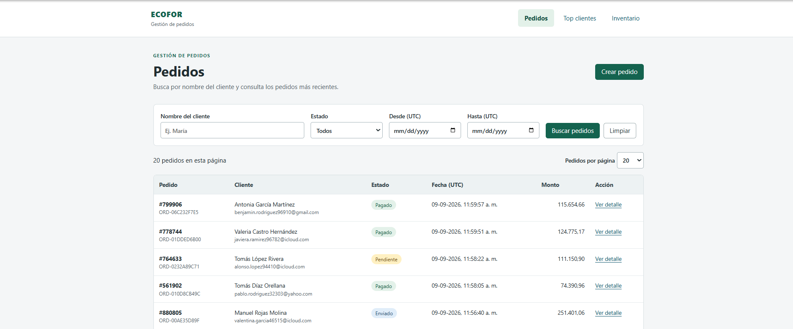
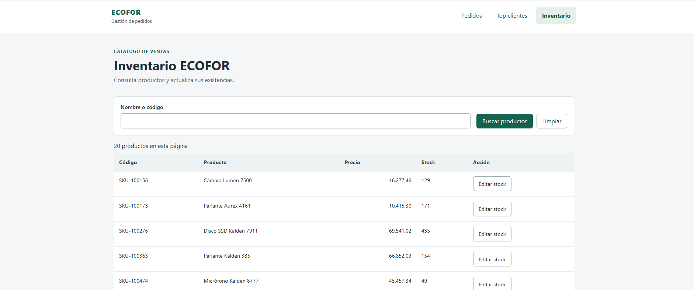
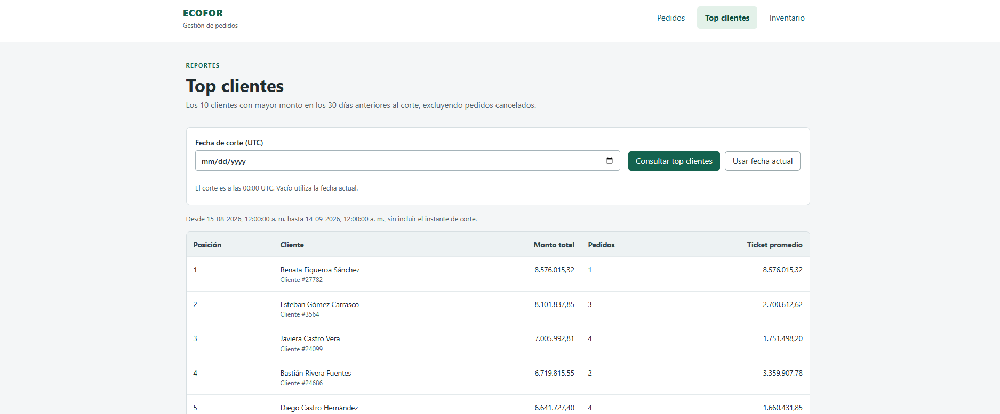

# ECOFOR — Gestión de pedidos

Prueba técnica con PostgreSQL 15+, Express, express-validator, React 19 y TypeScript. El cliente usa estado local, fetch nativo y CSS. Incluye listado, creación y detalle de pedidos, top clientes y simulación de descuentos.

## Capturas de la aplicación

### Gestión de pedidos

Listado de pedidos con filtros por cliente, estado y fechas, y acceso al detalle.



### Inventario

Catálogo de ventas cargado desde `products.csv`, con búsqueda por nombre o SKU, paginación y edición de stock.



### Top clientes

Ranking de los 10 clientes con mayor monto en los 30 días anteriores a la fecha de corte, excluyendo pedidos cancelados.



## Ejecutar

Requisitos: Node **24.15+ de la rama 24**, npm y Docker Desktop. Colocar en `data/`: `customers.csv`, `products.csv`, `orders.csv` y `order_items.csv`.

**PostgreSQL corre en Docker**, accesible en `127.0.0.1:5434`. Para volver a iniciar el sistema, ejecutar `docker compose up -d --wait` y arrancar backend/frontend; los datos se conservan.

Para una **base nueva**, desde la raíz en PowerShell. Antes de ejecutar `npm ci` o `npm run setup`, detener los servidores con Ctrl+C para liberar los archivos de `node_modules` en Windows:

```powershell
Copy-Item backend/.env.example backend/.env
docker compose up -d --wait
npm ci
npm run setup
npm --prefix backend run migrate

# Crear la carpeta data en la raíz y adjuntar los CSVs

npm --prefix backend run ingest:orders
```

Conservar `backend/.env` si la base ya estaba configurada; debe usar `DB_PORT=5434` y las credenciales del contenedor.

Iniciar el backend y el frontend en **terminales separadas**:

```powershell
npm --prefix backend run dev
```

```powershell
npm --prefix frontend run dev
```

- Cliente: http://127.0.0.1:5173
- API: http://127.0.0.1:3000
- Vite redirige `/api` al backend. Para otra dirección, usar `frontend/.env.example` y definir `VITE_API_URL`.

En el menú, **Top clientes** permite consultar el ranking por fecha de corte. Desde el detalle de un pedido, **Simular descuentos** permite comparar cupones de porcentaje, monto fijo y N por M; muestra el ahorro por ítem sin modificar el pedido.

El inventario anterior se carga opcionalmente con `npm --prefix backend run ingest`, usando `data/ecofor_simulacion_inventario.csv`. En macOS/Linux, reemplazar `Copy-Item` por `cp`.

## Decisiones

- **Modelo:** claves naturales para las referencias CSV e IDs numéricos para HTTP. Precios con NUMERIC y fechas con TIMESTAMPTZ; montos JSON con dos decimales.
- **Ingesta:** COPY a tablas temporales y sincronización en una transacción. Repetir los mismos archivos conserva las mismas filas e IDs. Ante emails/SKU repetidos prevalece la última aparición; se conservan todas las filas fuente. Las referencias ausentes quedan pendientes, sin perder pedidos ni ítems.
- **Stock:** creación transaccional y bloqueo de productos con FOR UPDATE en orden de ID. Un fallo revierte todo; las solicitudes concurrentes no venden más stock del disponible.
- **Listado:** cursor por `created_at DESC, id DESC`, 20 filas por defecto y máximo 100. Se suman solo los ítems de la página; se evita OFFSET sobre millones de pedidos.
- **Descuentos:** cálculo independiente sobre montos originales, en centavos con BigInt y tope por ítem. Se compara el conjunto acumulable con cada cupón exclusivo; no hace falta explorar todas las combinaciones.
- **React:** estado local porque filtros y formularios pertenecen a cada vista. Cada feature separa `components/` presentacionales, `containers/` y `hooks/` con estado y HTTP. Se cancelan lecturas obsoletas y se bloquea el doble envío al crear.

**La ingesta reemplaza la instantánea de ventas:** restablece stock y estados del CSV, y elimina pedidos creados por API que no estén en los archivos. Ejecutarla durante la preparación de datos, no como sincronización de ventas activas.

## Migración de channel

La migración `003_orders_channel.sql` agrega `channel TEXT NOT NULL DEFAULT 'web'`. PostgreSQL guarda el default constante en metadatos, evitando actualizar o reescribir 50 millones de filas. Usa una transacción corta, NOWAIT y reintentos para no quedar encolada detrás de consultas largas. Requiere un bloqueo exclusivo breve; no implica cero bloqueo.

El procedimiento, las consultas de cada endpoint y el DDL de índices están en [backend/README.md](backend/README.md), con sus justificaciones. Las migraciones completas están en [backend/migrations](backend/migrations).

## Pruebas

Con PostgreSQL preparado:

```powershell
npm run check
```

Ejecuta formato, TypeScript, pruebas de API e ingesta, descuentos, React, lint y build. Las pruebas de integración crean y eliminan bases temporales; requieren permiso CREATEDB.

Verificado: pruebas React, 6 de cálculo de descuentos, idempotencia y 100 solicitudes concurrentes (37 ventas con stock 37). Con 30 cupones y 100 ítems, el máximo local fue 17,1 ms. La migración se probó con lectores/escritores y sin reescritura, pero no con 50 millones de filas reales.

Para pruebas manuales: [colección Postman](backend/postman/ECOFOR.postman_collection.json).
