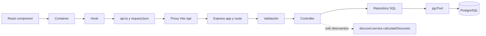

# Auditoría técnica de ECOFOR — guía de defensa oral

**Alcance.** Revisión del árbol actual del repositorio, sin cambios al código funcional. Las afirmaciones sobre implementación remiten a archivo y función o bloque SQL. `ai-sessions/` documenta iteraciones históricas y no sustituye al código actual. Se verificaron el typecheck del backend y 31 pruebas del frontend. La ejecución local de `test:discounts` falló antes de cargar pruebas por `uv_os_get_passwd`/`ENOMEM` en `tsx`; las pruebas de integración con PostgreSQL no se ejecutaron en esta auditoría. Ver `backend/package.json`, `frontend/package.json` y `ai-sessions/codex.md`.

## 1. Mapa completo del proyecto

```text
README.md, Running.md, compose.yaml, package.json
data/                  cuatro CSV de ventas (archivos locales ignorados por Git)
ai-sessions/           conversaciones de desarrollo, algunas de versiones previas
backend/
  migrations/          001 inventario antiguo; 002 ventas; 003 channel; 004 huérfanos; 005 IDs HTTP
  src/server.ts        arranque y comprobación de PostgreSQL
  src/app.ts           Express, middleware y montaje de rutas
  src/routes/          endpoints y cadenas de validación
  src/controllers/     contrato HTTP y delegación
  src/repositories/    SQL y transacciones
  src/services/        cálculo de descuentos, sin persistencia
  src/ingest-sales.ts  importación autoritativa de los cuatro CSV
  src/ingest.ts        importador separado del inventario antiguo
  src/migrate.ts       runner versionado de migraciones
  src/test-*.ts        pruebas de API, PostgreSQL, concurrencia e ingesta
frontend/
  src/main.tsx, App.tsx     arranque y selección de vistas
  src/features/            orders, products, reports, discounts
  src/shared/              fetch, navegación, lecturas cancelables, formato y UI común
  src/test/                pruebas Vitest y Testing Library
images/                    capturas del README
```

El flujo de lectura real es **React `main.tsx` → `App.tsx` → container → hook → `features/*/api.ts` → `shared/api/http.ts:requestJson` → proxy Vite `/api` → `app.ts` → route → validation → controller → repository SQL → `pg.Pool` → PostgreSQL**. En crear pedidos, `order.repository.ts:createOrder` concentra la lógica transaccional; no existe un `order.service.ts`. En descuentos sí aparece `discount.service.ts:calculateDiscounts` entre controller y repository, pero el repository allí solo lee la orden. Referencias: `frontend/src/main.tsx`, `frontend/src/App.tsx`, `frontend/src/features/orders/containers/OrdersContainer.tsx`, `frontend/src/features/orders/hooks/useCreateOrder.ts`, `frontend/src/shared/api/http.ts`, `frontend/vite.config.ts`, `backend/src/app.ts`, `backend/src/routes/order.routes.ts`, `backend/src/controllers/order.controller.ts`, `backend/src/repositories/order.repository.ts`, `backend/src/controllers/discount.controller.ts`.



La responsabilidad de presentación reside en `features/*/components/`, el pegamento props/estado en `containers/`, la orquestación en `hooks/`, el transporte en `api.ts` y los modelos de vista en `models.ts`. Es una convención efectiva de este frontend, descrita además en `frontend/README.md`, y puede verificarse, por ejemplo, en `OrdersListContainer`, `useOrdersList`, `orders/api.ts` y `OrdersList.tsx`.

## 2. Stack real y preguntas que habilita

- **Node.js, TypeScript, tsx**: ejecutan backend `.ts` directamente y comprueban tipos estrictos. `backend/package.json`, `backend/tsconfig.json`, `backend/src/server.ts`. Elección probable: un solo lenguaje cliente/servidor y desarrollo rápido. Pregunta: ¿qué verifica `tsc --noEmit` y qué no verifica en runtime?
- **Express 5, cors, express-validator**: HTTP, CORS abierto y cadenas `body`/`query`/`param` con `validationResult`. `backend/src/app.ts`, `backend/src/routes/*.ts`, `backend/src/middleware/*.ts`. Pregunta: ¿en qué orden actúan `express.json`, `requireJson`, validadores y `validateRequest`? En `POST /orders` es exactamente ese orden (`app.ts`, `order.routes.ts`, `order.validation.ts`).
- **pg y PostgreSQL 15+**: pool, parámetros `$n`, transacciones, `FOR UPDATE`, `COPY`, CTE y GIN trigram. `backend/src/db.ts`, `backend/src/repositories/*.ts`, `backend/migrations/*.sql`. Pregunta: ¿por qué una transacción usa la misma conexión de `pool.connect()`?
- **pg-copy-streams, Node streams**: `createReadStream` → `pipeline` → `COPY FROM STDIN`; evita cargar CSV completos en memoria JS. `backend/src/ingest-sales.ts:ingestSales`. Pregunta: ¿qué queda en memoria y qué se materializa en PostgreSQL?
- **csv-parse/sync**: importador antiguo de `public.products`, que sí lee el archivo completo y hace UPSERT fila a fila. `backend/src/ingest.ts:main`. Pregunta: ¿por qué no escala igual que `COPY`?
- **dotenv**: configuración de DB y puerto. `backend/src/db.ts`, `backend/src/server.ts`, `backend/.env.example`. Pregunta: ¿qué precedencia tiene `DATABASE_URL`?
- **React 19, react-dom, Vite**: UI, render y proxy de desarrollo. `frontend/package.json`, `frontend/src/main.tsx`, `frontend/vite.config.ts`. Pregunta: ¿cómo llega `/api/orders` al puerto 3000?
- **fetch nativo, AbortController, estado local**: transporte y cancelación de lecturas. `frontend/src/shared/api/http.ts:requestJson`, `frontend/src/shared/hooks/useReadRequest.ts`, hooks de features. Pregunta: ¿por qué cancelar no basta sin comprobar `signal.aborted`?
- **Vitest, jsdom, Testing Library, user-event, jest-dom**: pruebas de interacción y red simulada. `frontend/vitest.config.ts`, `frontend/src/test/*.ts*`. Pregunta: ¿qué cubre una prueba de UI con fetch mock y qué no cubre?
- **node:test/assert, Docker Compose, Postman, Prettier, oxlint**: pruebas de algoritmo/integración, DB local, colección manual, formato y lint. `backend/src/services/discount.service.test.ts`, `backend/src/test-backend.ts`, `compose.yaml`, `backend/postman/ECOFOR.postman_collection.json`, `package.json`, `frontend/package.json`. Pregunta: ¿por qué la prueba de concurrencia necesita DB real?
- **pg_trgm**: extensión para acelerar `ILIKE '%texto%'` sobre `sales.customers.full_name`. `backend/migrations/005_http_order_ids.sql`; filtro en `backend/src/repositories/order.repository.ts:buildOrdersQuery`. Pregunta: ¿por qué un B-tree normal no suele servir para un patrón con `%` inicial?

No aparecen ORM, Redux, React Router, caché compartida ni sistema externo de cupones: **NO IMPLEMENTADO** (`backend/package.json`, `frontend/package.json`, `frontend/src/shared/hooks/useNavigation.ts`, `backend/src/services/discount.service.ts`). Las razones exactas de elección de librerías son inferencias; los README explican algunas decisiones, pero **NO PUEDO DETERMINAR DEL CÓDIGO** la motivación personal de cada dependencia.

## 3. Backend: inventario de endpoints

Todas las rutas se montan en `backend/src/app.ts:27-30`. Las de `/orders` y `/reports` existen además con prefijo `/api`; el frontend usa ese alias (`frontend/src/shared/api/http.ts:requestJson`). Los errores comunes se serializan como `{code,message,details?}` en `backend/src/middleware/errors.ts:errorHandler`; los errores de validación usan `{code:'VALIDATION_ERROR',message,errors}` en `validate.ts:validateRequest`. Los cuerpos JSON superan 1 MB → 413; JSON inválido → 400; codificación/tipo no admitido → 415; lock timeout, deadlock, cancelación SQL o serialización → 503 con `Retry-After: 1`; otro error → 500 (`app.ts:11`, `errors.ts`).

- **GET `/` y GET `/health`**: respuesta 200 con metadatos de API o `{status:'ok'}`; no consultan DB ni validan parámetros. `backend/src/app.ts:12-26`.
- **GET `/api/products`**: inventario heredado `public.products`, filtros opcionales `search` y `category`, sin paginación; SQL `SELECT ... FROM products`, `ILIKE` sobre nombre/código, igualdad de categoría, `ORDER BY codigo`. 200 `{data,count}`; 400 validación; 500 DB. `backend/src/routes/product.routes.ts:10-18`, `backend/src/controllers/product.controller.ts:getProducts`, `backend/src/repositories/product.repository.ts:findProducts`.
- **PATCH `/api/products/:id/stock`**: `id` entero positivo, `stock` entero JSON de 0 a 2.147.483.647; `UPDATE products SET stock=$1,updated_at=NOW() WHERE id=$2 RETURNING ...`, autocommit. 200 `{data}`, 400, 404 `{message}`, 500. Solo afecta `public.products`. `product.routes.ts:20-32`, `product.controller.ts:patchProductStock`, `product.repository.ts:updateProductStock`.
- **GET `/api/customers`**: `search`, `after`, `limit` 1–100, 20 por defecto; `email > after`, búsqueda literal parcial `ILIKE` por nombre/email, `ORDER BY email LIMIT limit+1`. 200 `{data,nextCursor}`, 400, 500. `catalog.routes.ts:8`, `order.validation.ts:catalogValidation`, `order.controller.ts:getCustomers`, `order.repository.ts:findCustomers`.
- **GET `/api/catalog/products`**: mismos parámetros, cursor `sku > after`, `ILIKE` nombre/SKU, `ORDER BY sku LIMIT limit+1`; 200 `{data,nextCursor}`, 400, 500. `catalog.routes.ts:9`, `order.controller.ts:getCatalogProducts`, `order.repository.ts:findCatalogProducts`.
- **PATCH `/api/catalog/products/:id/stock`**: `id` entero, `stock` entero JSON 0–2.147.483.647; `UPDATE sales.products ... RETURNING`; 200 `{data:{id,sku,name,price,stock}}`, 400, 404 `{message}`, 500. Es el mismo stock que usa `POST /orders`; el UPDATE toma lock de fila propio. `catalog.routes.ts:10-19`, `product.controller.ts:patchCatalogStock`, `product.repository.ts:updateCatalogStock`. Esta ruta no incluye `requireJson`, de modo que un Content-Type distinto acaba en 400 de validación si falta `stock`, a diferencia de `/orders`.
- **POST `/orders` o `/api/orders`**: `requireJson`, objeto solo con `customer_id` entero y `items` no vacío de `{product_id,quantity}` enteros positivos; se valida suma por producto ≤ 2.147.483.647. El controller responde 201 `{data:detalle}` y `Location`. En una transacción: cliente `FOR KEY SHARE`, productos ordenados `FOR UPDATE`, comprobación de stock, UPDATE condicionado por lote, INSERT orden `WEB-UUID`, INSERT ítems desde JSON conservando líneas repetidas y precio actual, SELECT de detalle y COMMIT. 400/404 cliente o producto/409 stock/503 lock/500. `order.routes.ts:14`, `order.validation.ts:createOrderValidation`, `order.controller.ts:postOrder`, `order.repository.ts:createOrder`, `order.repository.ts:ORDER_DETAIL_SQL`.
- **GET `/orders` o `/api/orders`**: filtros `status`, `customer`, `customer_email`, `order_ref`, `from`, `to`, `limit`, `cursor`; fechas normalizadas a UTC y comparación `to >= from`; filtro de nombre con subquery; CTE `page AS MATERIALIZED`, seek `(created_at,id)<cursor`, `ORDER BY ... DESC LIMIT limit+1`, luego joins/total por ítems. 200 `{data,nextCursor,page_size,has_more}`, 400 cursor/filtro, 500. `order.routes.ts:15`, `order.validation.ts:listOrdersValidation`, `order.controller.ts:getOrders`, `order.repository.ts:buildOrdersQuery/findOrders`.
- **GET `/orders/:id` o alias `/api`**: ID entero 1–2.147.483.647; SQL por `orders.id` con LEFT JOIN cliente y LATERAL de ítems/total JSON; 200 `{data}`, 400 o 404 `ORDER_NOT_FOUND`, 500. Sin transacción explícita; una sentencia ve un snapshot. `order.routes.ts:16`, `order.controller.ts:getOrder`, `order.repository.ts:ORDER_DETAIL_SQL/findOrder`.
- **PATCH `/orders/:id/status` o alias**: ID y `status`,`expected_status` deben pertenecer a los cuatro estados; `UPDATE ... WHERE id=$2 AND status=$3 RETURNING`. 200 `{data:{id,order_ref,status}}`; 400, 409 si ID ausente o estado cambiado, 500. Es compare-and-swap en DB, pero no repone stock al cancelar ni restringe transiciones. `order.routes.ts:18`, `order.validation.ts:statusOrderValidation`, `order.controller.ts:patchOrderStatus`, `order.repository.ts:updateOrderStatus`.
- **GET `/reports/top-customers` o alias**: `as_of` ISO opcional, por defecto fecha UTC actual a medianoche; CTE de ventana 720 horas, no cancelados con `customer_key`, agregados por orden y cliente, top 10. 200 `{as_of,data}`; 400 fecha, 500 DB. `report.routes.ts`, `report.validation.ts`, `report.controller.ts:getTopCustomers`, `report.repository.ts:TOP_CUSTOMERS_SQL`.
- **POST `/orders/:id/apply-discounts` o alias**: ID, JSON `{coupons}` con máximo 30, códigos únicos y validación por tipo; SELECT de líneas históricas, máximo 100 ítems y `calculateDiscounts` puro. 200 `{order_id,subtotal,applied_coupons,total_discount,total,items}`, 400 payload, 404 orden, 422 >100 líneas, 500. No hay SQL de escritura ni transacción explícita. `order.routes.ts:17`, `discount.validation.ts:discountValidation`, `discount.controller.ts:applyDiscounts`, `discount.repository.ts:findDiscountOrder`, `discount.service.ts:calculateDiscounts`.

El middleware `requireJson` precede las validaciones de los POST y PATCH de órdenes, y `validateRequest` detiene errores acumulados antes del controller (`order.routes.ts`, `errors.ts:requireJson`, `validate.ts`). Express 5 propaga los rechazos de handlers async al error handler final (`app.ts:32`); los handlers heredados de productos además llaman `next(error)` explícitamente (`product.controller.ts`).

## 4. POST /orders y concurrencia — respuesta de pizarra

**Carrera evitada.** Sin sincronización, A y B leerían stock 1, ambos aceptarían una unidad y crearían dos pedidos. En `order.repository.ts:createOrder`, una transacción por request usa una conexión dedicada; primero suma cantidades duplicadas con `Map`, ordena IDs, toma `FOR KEY SHARE` en cliente y `FOR UPDATE` en productos; compara stock ya bloqueado; luego ejecuta `UPDATE ... SET stock=stock-quantity ... AND stock>=quantity RETURNING`. El `CHECK(stock>=0)` en `002_sales.sql` es otra defensa. INSERT de orden, ítems y SELECT de detalle ocurren antes de COMMIT. Todo error cae en ROLLBACK y libera cliente en `finally` (`order.repository.ts:134-203`).

**100 requests por una unidad y stock 37.** En el test hay 100 HTTP concurrentes sin semáforo del cliente. Uno obtiene primero el lock de la fila; otros esperan (la cantidad de conexiones activas depende del pool). Cada ganador ve el stock confirmado anterior, resta 1, crea orden e ítem y confirma. Al llegar a 0, los restantes detectan insuficiencia y responden 409 sin crear filas. El test exige 37 respuestas 201, 63 respuestas 409, stock final 0 y 37 unidades vendidas (`backend/src/test-backend.ts:250-274`). **No hay garantía de orden FIFO** para requests; sí de no vender más de 37 si la DB y condiciones del test se cumplen. Un request puede responder 503 si supera los timeouts, por lo que 37/63 es resultado del escenario probado, no promesa universal (`order.repository.ts:142`, `errors.ts:42-47`).

**Aislamiento.** El código no ejecuta `SET TRANSACTION ISOLATION LEVEL`; **NO PUEDO DETERMINAR DEL CÓDIGO** si la instancia cambió el default. En PostgreSQL el default normal es READ COMMITTED; los locks y el UPDATE condicionado son suficientes para la invariante local de stock. `FOR UPDATE` serializa el acceso a cada producto, mientras el orden de ID reduce deadlocks entre pedidos multiproducto. El `UPDATE` condicionado sigue protegiendo ante cambios de stock entre comprobación y escritura; no es un mutex de Node y funciona entre procesos (`order.repository.ts:createOrder`).

**Lo mejorable.** No hay clave de idempotencia: si el servidor confirmó pero el cliente perdió la respuesta, reintentar puede crear otro pedido (`order.repository.ts:184`, `frontend/src/features/orders/hooks/useCreateOrder.ts:50-63`). Los 10 segundos de espera y 15 de sentencia pueden producir 503 bajo alta contención (`order.repository.ts:142`). Un `PATCH` de stock puede fijar un valor nuevo antes/después de una compra y requiere reglas de inventario de negocio (`product.repository.ts:updateCatalogStock`). La cancelación no restaura stock (`order.repository.ts:updateOrderStatus`). Respuesta oral: *«La transacción y `FOR UPDATE` hacen que cada compra observe stock actualizado; el UPDATE condicionado y CHECK refuerzan la invariante; si algo falla revierto stock, pedido e ítems. Para producción sumaría idempotency key y una política explícita de reservas/cancelaciones»*.

## 5. Modelo de datos real tras 001–005

- **`public.products` (inventario heredado)**: `id BIGSERIAL PK`; `codigo VARCHAR(50) NOT NULL UNIQUE`; `nombre`, `categoria` TEXT NOT NULL no vacíos; `precio`, `stock` INTEGER NOT NULL ≥0; `proveedor TEXT NULL`; `fecha_actualizacion DATE NOT NULL`; `created_at`, `updated_at TIMESTAMPTZ NOT NULL DEFAULT NOW()`. `backend/migrations/001_inventory.sql`. No es `sales.products` ni alimenta pedidos (`product.repository.ts:findProducts`, `order.repository.ts:createOrder`). `backend/schema.sql` repite el baseline sin `public.` explícito.
- **`sales.customers`**: `email TEXT PK` no vacío, `full_name` y `city` TEXT NOT NULL no vacíos, `id INTEGER GENERATED ALWAYS AS IDENTITY UNIQUE` (identidad HTTP). `002_sales.sql:3-7`, `005_http_order_ids.sql:4-5`.
- **`sales.products`**: `sku TEXT PK` no vacío, `name TEXT NOT NULL` no vacío, `price NUMERIC NOT NULL` no negativo, finito y escala ≤2; `stock INTEGER NOT NULL CHECK>=0`; `id INTEGER IDENTITY UNIQUE`. `002_sales.sql:9-14`, `005_http_order_ids.sql:6-7`.
- **`sales.orders`**: `order_ref TEXT PK` no vacío; `customer_email TEXT NOT NULL` conserva referencia CSV original, sin FK después de 004; `status TEXT NOT NULL CHECK` en pending/paid/shipped/cancelled; `created_at TIMESTAMPTZ NOT NULL` finito; `channel TEXT NOT NULL DEFAULT 'web'`; `customer_key TEXT NULL FK→customers(email)` con `CHECK(customer_key IS NULL OR customer_key=customer_email)`; `id INTEGER IDENTITY UNIQUE`. `002_sales.sql:16-21`, `003_orders_channel.sql`, `004_source_integrity.sql:3-6`, `005_http_order_ids.sql:8-9`.
- **`sales.order_items`**: `source_row BIGINT NULL UNIQUE CHECK>0` ordinal CSV, NULL para HTTP; `order_ref TEXT NOT NULL` original sin FK después de 004; `sku TEXT NOT NULL FK→products(sku)`; `quantity INTEGER NOT NULL CHECK>0`; `unit_price NUMERIC NOT NULL` no negativo, finito y escala ≤2; `order_key TEXT NULL FK→orders(order_ref)` con CHECK igual a `order_ref` si existe; `id INTEGER IDENTITY PK`. `002_sales.sql:23-30`, `004_source_integrity.sql:8-11`, `005_http_order_ids.sql:11-16`.
- **`sales.customer_source_rows` y `sales.product_source_rows`**: cada una tiene `source_row BIGINT PK CHECK>0`, clave natural con FK al padre y copia tipada de columnas del CSV. Capturan filas duplicadas sin escogerlas silenciosamente como entidad principal. Los `price`/`stock` de `product_source_rows` son `NUMERIC`/`INTEGER NOT NULL`, sin los CHECK de precio/stock del padre definidos en esta tabla; el staging sí hereda checks del padre. `004_source_integrity.sql:13-26`, `ingest-sales.ts:39-76`.
- **`public.schema_migrations`**: `version TEXT PK`, `checksum TEXT NOT NULL`, `applied_at TIMESTAMPTZ NOT NULL DEFAULT now()`. `backend/src/migrate.ts:20-22`.

Relaciones: una ficha `customers` puede resolver muchos `orders` por `customer_key`; `orders` puede tener muchas líneas por `order_key`; `products` puede aparecer en muchas líneas por `sku`. Las referencias originales se preservan cuando falta cliente/pedido, usando `*_key NULL` y sin inventar entidades (`004_source_integrity.sql`, `ingest-sales.ts:86-120`). `unit_price` en la línea fija el precio al momento de compra/importación: cambiar `sales.products.price` no reescribe la historia ni el reporte; el test lo comprueba (`order.repository.ts:createOrder:187-193`, `test-backend.ts:301-306`, `report.repository.ts:10`).

## 6. Migraciones y `channel` con 50 millones

`migrate.ts:migrate` verifica PostgreSQL ≥15, toma advisory lock compartido con la ingesta, descubre `NNN_*.sql` ordenados, calcula SHA-256, omite versiones iguales y rechaza una aplicada cuyo checksum cambió. Cada nueva migración y registro de versión son una transacción, con hasta siete reintentos tras `55P03`; `--through` corta en la versión indicada (`backend/src/migrate.ts:10-65`). **Rollback/down automático: NO IMPLEMENTADO** (`migrate.ts`, `backend/package.json`).

1. `001_inventory.sql` crea el inventario antiguo `public.products` si no existe.
2. `002_sales.sql` crea schema y cuatro tablas de ventas, índices iniciales.
3. `003_orders_channel.sql` usa `SET LOCAL lock_timeout='100ms'`, `statement_timeout='3s'`, `LOCK TABLE sales.orders IN ACCESS EXCLUSIVE MODE NOWAIT`, luego `ADD COLUMN channel TEXT NOT NULL DEFAULT 'web'`.
4. `004_source_integrity.sql` sustituye FK obligatorias de pedidos y líneas por claves vinculadas opcionales, crea tablas de filas fuente e índices.
5. `005_http_order_ids.sql` agrega IDs identity, cambia PK de líneas, permite `source_row NULL`, agrega índices de cursor y `pg_trgm`.

**Tu implementación de 003:** el default literal no volátil se almacena en metadatos y las filas antiguas leen `web` sin UPDATE ni reescritura del heap; lo confirma la prueba que compara `relfilenode` y consulta `atthasmissing` (`003_orders_channel.sql`, `test-orders.ts:45-95`; [PostgreSQL 15 ALTER TABLE](https://www.postgresql.org/docs/15/sql-altertable.html)). `ACCESS EXCLUSIVE` sí bloquea lecturas/escrituras mientras se sostiene; `NOWAIT` evita esperar detrás de un lector largo y el runner hace ROLLBACK y espera fuera de transacción antes de reintentar (`migrate.ts:37-55`; [bloqueos PostgreSQL](https://www.postgresql.org/docs/15/explicit-locking.html)). No equivale a cero downtime. El test usa una tabla pequeña con un lector bloqueante, no 50 millones (`test-orders.ts:40-96`, `backend/README.md:26`).

**Producción a 50 millones:** desplegar primero código tolerante a esquema viejo/nuevo, ejecutar 003 en ventana observada, monitorizar locks y latencia, repetir si el lock no se consigue y, si se requiere otro índice, crearlo `CONCURRENTLY` en otro procedimiento. Una estrategia expand/backfill/contract sería necesaria si el default fuera volátil o se transformaran filas. **004 y 005 no son migraciones online equivalentes**: hacen UPDATE, cambios de constraints y construcción de índices sin `CONCURRENTLY`, pueden escanear/rewrite y bloquear tráfico (`004_source_integrity.sql`, `005_http_order_ids.sql`, `backend/README.md:26`). Respuesta oral: *«La operación específica de 003 evita el costo proporcional a 50 M filas, pero necesita una ventana breve de bloqueo exclusivo; por eso NOWAIT y reintentos. La garantía no se extrapola a 004/005»*.

## 7. Ingesta de los cuatro CSV

`ingest-sales.ts:datasets/ingestSales` exige los cuatro archivos. Dentro de una conexión con advisory lock y transacción, crea cuatro tablas temporales tipadas con `LIKE ... INCLUDING CONSTRAINTS INCLUDING DEFAULTS`, añade ordinales `source_row` por identity a customers/products/items, y carga cada CSV con `createReadStream` + `pipeline` + `COPY ... HEADER MATCH`. No hay lote de INSERT desde JS; el flujo es streaming y el servidor materializa staging en DB. Después agrega PK temporales, reduce customers/products con `DISTINCT ON(clave) ... ORDER BY clave,source_row DESC` (última aparición), `ANALYZE` y valida que cada SKU de línea exista en products. Referencias: `backend/src/ingest-sales.ts:27-93`.

Luego toma `SHARE ROW EXCLUSIVE` en seis tablas: lectores normales siguen, escritores esperan. Hace UPSERT por clave natural en customers/products/orders y por `source_row` en order_items, con `WHERE ... IS DISTINCT FROM` para evitar UPDATE de filas iguales; guarda todas las filas duplicadas de customer/product en tablas `*_source_rows`; finalmente `DELETE ... NOT EXISTS` en orden inverso para quitar filas fuera del snapshot. COMMIT atómico; un fallo hace ROLLBACK, y después corre `ANALYZE` fuera de la transacción (`ingest-sales.ts:94-149`). `SHARE ROW EXCLUSIVE` bloquea escrituras concurrentes, no lecturas `SELECT` ordinarias ([PostgreSQL 15 locking](https://www.postgresql.org/docs/15/explicit-locking.html)).

**Idempotencia exacta de filas.** El mismo archivo produce los mismos valores tipados y `source_row`; conflictos idénticos no ejecutan UPDATE; el DELETE no halla sobrantes; por eso permanecen filas e IDs de las entidades ya existentes. `test-orders.ts:135-161` compara snapshots completos después de dos ingestas. Matiz esencial: las secuencias identity pueden avanzar durante intentos de INSERT que chocan con `ON CONFLICT`; por eso *idéntico estado lógico de filas* no significa identidad del estado interno de secuencias. `verify-ingestion.ts:fingerprints` compara filas, no secuencias. Además, si hay ventas entre cargas, el segundo snapshot **restablece stock y estados CSV y elimina pedidos HTTP ausentes**: no es una sincronización online; el README lo advierte (`ingest-sales.ts:116-136`, `README.md`, `verify-ingestion.ts`). `channel` de órdenes existentes se conserva porque no figura entre columnas sincronizadas; nuevas reciben `web` (`ingest-sales.ts:13-23,99-120`, `test-orders.ts:160-173`).

Huérfanos: pedido con email ausente conserva `customer_email` y `customer_key=NULL`; línea con `order_ref` ausente conserva valor y `order_key=NULL`; SKU de línea ausente **aborta** toda ingesta. No inventa clientes ni pedidos (`ingest-sales.ts:86-120`, `004_source_integrity.sql`). Duplicados de `order_ref` abortan por PK de staging; pares pedido/SKU repetidos de líneas permanecen porque la identidad fuente es ordinal (`ingest-sales.ts:68-76`, `test-orders.ts:113-159,203-212`).

**Escala y riesgo:** una transacción larga, sorting/materialización de `DISTINCT ON`, índices temporales, `count(*)` y `ANALYZE`, upserts y borrados completos consumen I/O, WAL, espacio temporal y generan bloat; el lock de escritores puede agotar 5 s (`ingest-sales.ts:36-140`). El importador antiguo es otro proceso: `ingest.ts:main` lee el CSV completo en JS (`readFileSync`, `csv-parse/sync`), valida filas, hace UPSERT uno por uno y cambia `updated_at` en cada recarga; por ello su fila timestamp no es estrictamente idempotente (`ingest.ts:110-203`).

## 8. SQL importante, leído línea por línea

- **Pedido nuevo** (`order.repository.ts:createOrder:141-196`): `BEGIN` une operaciones; `SELECT customer FOR KEY SHARE` fija la FK natural; `SELECT products ... ORDER BY id FOR UPDATE` fija stock; `UPDATE FROM unnest(ids,cantidades)` resta por producto con condición de suficiencia; `INSERT orders ... RETURNING` crea referencia e ID; `INSERT order_items SELECT ... FROM jsonb_to_recordset JOIN products` expande líneas del payload y copia precio vigente; `ORDER_DETAIL_SQL` construye respuesta en el mismo commit. Accesos principales: unique `customers_id_key`, `products_id_key`, `orders_pkey`, `order_items_order_row_idx`. Costo aproximado para k productos y n líneas: k búsquedas/locks y n escrituras, más espera por contención. Bottleneck: producto caliente.
- **Listado** (`order.repository.ts:buildOrdersQuery:51-91`): el WHERE es suma de filtros presentes con parámetros, subquery de cliente para `ILIKE`, rango de fecha y tupla cursor; `page AS MATERIALIZED` fija solo limit+1 cabeceras ordenadas; `LEFT JOIN customers` preserva pedidos sin ficha; `CROSS JOIN LATERAL` calcula suma y `count(*)` por cabecera; `COALESCE` convierte total nulo a cero; `ORDER BY` final restaura orden. Índices clave `orders_created_id_idx`, `orders_status_created_id_idx`, `orders_customer_created_id_idx` según filtro, `order_items_order_row_idx` para líneas; `customers_full_name_trgm_idx` puede ayudar al nombre. Costo ≈ seek y hasta 101 agregados de líneas; búsqueda textual muy amplia puede exigir trabajo sobre muchos clientes/pedidos.
- **Detalle** (`order.repository.ts:ORDER_DETAIL_SQL:108-125`): busca ID único; LEFT JOIN cliente opcional; LATERAL suma `quantity*unit_price` y `jsonb_agg` ordenado por id; JOIN de producto aporta nombre e ID, nunca sustituye el precio histórico. Una sola sentencia evita N+1 y ve un snapshot. Índices: `orders_id_key`, `order_items_order_row_idx`, `products_pkey`; costo crece con líneas del pedido.
- **Top clientes** (`report.repository.ts:TOP_CUSTOMERS_SQL:3-20`): CTE recent_orders acota tiempo, excluye cancelled y huérfanos; LEFT JOIN líneas y `GROUP BY order_ref,customer_key` da monto por pedido; segundo GROUP BY cliente suma montos y cuenta pedidos; JOIN a ficha obtiene nombre/ID; divide monto por número de pedidos, ordena por monto numérico/ID y limita 10. Índices de fecha y `order_items_order_row_idx`; costo proporcional a pedidos/líneas de la ventana, no a 10, porque el LIMIT llega después del agregado.
- **Cupones** (`discount.repository.ts:DISCOUNT_ORDER_SQL:15-22`): busca orden por ID, LATERAL agrega líneas con precio histórico; no escribe ni une tabla de cupones. Costo proporcional a líneas de orden, aunque el límite de 100 se comprueba **después** de traerlas (`discount.controller.ts:6-15`).
- **Catálogos** (`order.repository.ts:findCustomers/findCatalogProducts:215-252`): `after` busca clave natural mayor, `ILIKE` parcial y `ORDER BY ... LIMIT limit+1`; PK puede hacer seek por email/SKU, búsqueda con `%` inicial puede requerir scan si no hay índice trigram correspondiente (solo existe para `full_name`).
- **Stock/status** (`product.repository.ts:updateCatalogStock/updateProductStock`, `order.repository.ts:updateOrderStatus`): UPDATE parametrizado con RETURNING; status añade `AND status=expected_status`, detección optimista de conflicto. `public.products` y `sales.products` son tablas distintas.
- **Ingesta/migraciones**: `COPY` lleva bytes a staging; `DISTINCT ON` escoge última aparición; `ON CONFLICT DO UPDATE ... WHERE IS DISTINCT FROM` evita reescritura de valores iguales; `DELETE NOT EXISTS` elimina ausentes; `ALTER TABLE ADD COLUMN` de 003 cambia metadatos. SQL en `ingest-sales.ts:40-140`, `migrations/003_orders_channel.sql`.

Los planes reales, cardinalidades, selectividad y latencia en 1 M/50 M filas **NO PUEDO DETERMINARLOS DEL CÓDIGO**: requieren `EXPLAIN (ANALYZE, BUFFERS)` y medición en datos/equipo representativos. Las complejidades anteriores describen forma de trabajo, no un plan garantizado.

## 9. Todos los índices definidos

**Explícitos B-tree** (salvo GIN indicado), en `002_sales.sql`, `004_source_integrity.sql`, `005_http_order_ids.sql`:

- `orders_created_ref_idx(created_at DESC,order_ref DESC)`, `orders_status_created_ref_idx(status,created_at DESC,order_ref DESC)`, `orders_customer_created_ref_idx(customer_email,created_at DESC,order_ref DESC)`: versión inicial con referencia como desempate. El primero/segundo están hoy solapados por variantes con ID; el tercero sirve filtro exacto por email original, incluido huérfano. Igualdad (`status`/`customer_email`) va antes de fecha para restringir rango; un status frecuente puede ser poco selectivo (`002_sales.sql:33-35`, `order.repository.ts:58-78`).
- `order_items_order_row_idx(order_ref,source_row) INCLUDE(quantity,unit_price)`: localiza líneas de cada orden y cubre agregados si visibility map permite index-only scan; `source_row` en segundo lugar ordenaba CSV, mientras el detalle actual ordena por `id` y puede ordenar aparte. `order_items_sku_idx(sku)` soporta FK/búsqueda de líneas por producto. `002_sales.sql:36-37`, `order.repository.ts:85-87,118-123`.
- `orders_customer_key_idx(customer_key)` y `order_items_order_key_idx(order_key)`: índices en lado hijo de FK opcional; el primero queda cubierto por prefijo de `orders_customer_created_id_idx`, por lo que duplica costo de escritura. `customer_source_email_idx(email)` y `product_source_sku_idx(sku)` ayudan verificaciones FK de las tablas de trazabilidad. `004_source_integrity.sql:27-30`.
- `orders_created_id_idx(created_at DESC,id DESC)`: seek general; `orders_status_created_id_idx(status,created_at DESC,id DESC)`: status más seek; `orders_customer_created_id_idx(customer_key,created_at DESC,id DESC)`: cliente resuelto más seek. Orden refleja igualdad primero, luego orden estable. `005_http_order_ids.sql:18-20`, `order.repository.ts:58-78`.
- `customers_full_name_trgm_idx USING gin(full_name gin_trgm_ops)`: acelera patrón parcial `ILIKE` del nombre; no garantiza uso si el patrón es corto/común o un scan resulta más barato. GIN ocupa espacio y cuesta INSERT/UPDATE; los B-tree también cuestan escrituras y almacenamiento. `005_http_order_ids.sql:21-22`, `order.repository.ts:59-63`.

**Implícitos B-tree unique/PK:** `public.products`: `products_pkey(id)`, `products_codigo_key(codigo)` (`001_inventory.sql`). `public.schema_migrations`: `schema_migrations_pkey(version)` (`migrate.ts:20-22`). `sales.customers`: `customers_pkey(email)`, `customers_id_key(id)`; `sales.products`: `products_pkey(sku)`, `products_id_key(id)`; `sales.orders`: `orders_pkey(order_ref)`, `orders_id_key(id)` (`002_sales.sql`, `005_http_order_ids.sql`). `sales.order_items`: `order_items_pkey(id)`, `order_items_source_row_key(source_row)` (`005_http_order_ids.sql`). `sales.customer_source_rows`: `customer_source_rows_pkey(source_row)` y `sales.product_source_rows`: `product_source_rows_pkey(source_row)` (`004_source_integrity.sql`). Cada PK/UNIQUE hace lookup y conflicto eficientes, con coste de mantenimiento en INSERT/UPDATE; `source_row NULL` permite múltiples líneas HTTP porque UNIQUE permite varios NULL. Los nombres de índices se repiten entre `public` y `sales` y se distinguen por schema.

**Lectura de cada índice implícito.** Todos son B-tree y costean una entrada/posible cambio de árbol por INSERT o UPDATE de su clave; ninguno mejora una consulta que no filtra, une u ordena por la clave correspondiente. `public.products_pkey(id)` sirve PATCH por ID; `public.products_codigo_key(codigo)` sirve UPSERT/búsqueda de inventario legado (`001_inventory.sql`, `product.repository.ts`, `ingest.ts`). `schema_migrations_pkey(version)` sirve consulta/registro de versión (`migrate.ts:20-46`). `sales.customers_pkey(email)` sirve FK/joins y UPSERT por email; `customers_id_key(id)` sirve selección del cliente HTTP (`002_sales.sql`, `005_http_order_ids.sql`, `order.repository.ts:143-149,215-232`). `sales.products_pkey(sku)` sirve FK/UPSERT y catálogo ordenado por SKU; `products_id_key(id)` sirve compra/PATCH HTTP (`order.repository.ts:151-193,234-252`, `product.repository.ts:updateCatalogStock`). `sales.orders_pkey(order_ref)` sirve ingesta y join de líneas; `orders_id_key(id)` sirve detalle, PATCH y descuentos (`order.repository.ts:108-132,206-213`, `discount.repository.ts:15-24`). `sales.order_items_pkey(id)` sirve identidad/orden de líneas; `order_items_source_row_key(source_row)` sirve UPSERT CSV y admite muchos NULL HTTP (`005_http_order_ids.sql:11-16`, `ingest-sales.ts:116-120`). `customer_source_rows_pkey(source_row)` y `product_source_rows_pkey(source_row)` sirven UPSERT y DELETE de filas fuente (`004_source_integrity.sql:14-26`, `ingest-sales.ts:122-132`). Sus claves naturales o IDs suelen ser selectivos, mientras PK de fuente tiene valor sobre todo durante ingesta; el planner puede preferir scan cuando debe leer gran parte de la tabla o si estadísticas/costo lo favorecen.

**Preguntas probables:** ¿por qué `status` lidera solo el índice filtrado?, ¿por qué el cursor exige `id`?, ¿por qué `customer_key` y `customer_email` tienen caminos separados?, ¿qué índices quedaron redundantes?, ¿cuándo un `ILIKE '%x%'` usa GIN?, ¿por qué FK no crea automáticamente índice hijo?, ¿qué aporta `INCLUDE` y cuándo no habrá index-only scan? Responder siempre citando la consulta del repository y el DDL anterior.

## 10. Paginación de GET /orders

Es **keyset/cursor, sin OFFSET**. `order.repository.ts:buildOrdersQuery` ordena `created_at DESC,id DESC` y, al recibir cursor, agrega `(o.created_at,o.id) < ($timestamp,$id)`. Pide `limit+1`, retorna solo `limit`, define `has_more` por fila extra y serializa `{created_at,id}` a JSON `base64url`; `decodeCursor` valida caracteres, tamaño, timestamp de seis microsegundos e ID (`order.repository.ts:94-105`, `utils/order-cursor.ts:6-22`). El ID desempata pedidos con el mismo timestamp; sin él se perderían/duplicarían filas en el borde. Los filtros deben ser iguales entre páginas; el frontend reinicia su pila de cursores al cambiarlos y guarda cursores anteriores para navegar atrás (`frontend/src/features/orders/hooks/useOrdersList.ts:33-74`).

Ejemplo: orden descendente `(12:00,id=8),(12:00,id=7),(11:59,id=20)`. Tras devolver el primero, cursor `(12:00,8)` hace `<` y admite `(12:00,7)` y anteriores. `OFFSET 1_000_000` tendría que recorrer/descartar cerca de 1 M entradas antes de producir la página y es sensible a inserciones entre páginas; el seek usa posición en B-tree (`order.repository.ts:69-78`, `005_http_order_ids.sql:18`). Aun así, keyset no congela un snapshot entre requests; una actualización de `created_at` o cambios de filtros pueden desplazar resultados. El cursor no está firmado ni ligado a filtros: se valida su forma, no su procedencia (`utils/order-cursor.ts`, `order.validation.ts:101-109`).

## 11. Top customers

`report.controller.ts:getTopCustomers` transforma `as_of`; si falta, usa la **fecha UTC actual a las 00:00**, no el instante actual. `utils/dates.ts:normalizeDate` acepta día o timestamp zonificado y conserva microsegundos. `report.repository.ts:TOP_CUSTOMERS_SQL` filtra `[as_of - interval '720 hours', as_of)`, esto es 30×24 horas, con límite inferior incluido y superior excluido. Omite `cancelled` y `customer_key NULL`; no atribuye huérfanos a personas inventadas. Primer `GROUP BY` por pedido evita multiplicar el conteo de órdenes por líneas; segundo agrupa por cliente y calcula `sum(amount)` y `count(*)`. Ticket = monto/pedidos, incluidos pedidos sin ítems con monto cero. Ordena por monto numérico descendente y ID ascendente, `LIMIT 10`. Precios de `order_items.unit_price`, no actuales del producto (`report.repository.ts:3-23`, `test-backend.ts:432-490`).

Guion oral: *«Primero recorto la ventana temporal y quito cancelados; luego calculo un monto por pedido con LEFT JOIN a sus ítems; después sumo y cuento pedidos por cliente. Si contara tras unir directamente ítems, un pedido de tres líneas aparecería tres veces. El top 10 se decide por suma numérica antes de formatear a texto»* (`report.repository.ts:TOP_CUSTOMERS_SQL`).

## 12. Cupones: algoritmo defendible en pizarra

No hay tabla de cupones ni canje persistido: cada payload describe cupones efímeros (`discount.validation.ts:validateCoupon`, `discount.service.ts:Coupon`, `discount.repository.ts`). `BaseCoupon` contiene `code`, `stackable`, `min_amount?` y `applicable_skus?`. Unión discriminada: `percentage(value)`, `fixed_amount(value)` o `n_for_m(sku,n,m)` (`discount.service.ts:4-19`). Validador exige objeto y campos admitidos, code no vacío, booleano, montos/porcentaje válidos (≤100), enteros `n>0`, `0≤m≤n`, códigos únicos, hasta 30 (`discount.validation.ts:13-79`). Pedido >100 líneas devuelve 422 tras la lectura (`discount.controller.ts:6-15`).

**Cálculo:** `calculateDiscounts` convierte `unit_price` a centavos BigInt, multiplica por cantidad y suma subtotal original (`discount.service.ts:43-46`, `utils/money.ts`). `min_amount` se evalúa contra ese **subtotal del pedido**, no contra el importe elegible (`discount.service.ts:50`). `applicable_skus`, si existe, limita líneas; para `n_for_m` además exige `item.sku=coupon.sku` (`discount.service.ts:52-58`). Cada cupón calcula descuento **independiente sobre montos originales**, sin reducir base por descuentos previos.

- `percentage`: calcula porcentaje racional sobre total elegible, redondea al centavo mitad hacia arriba y reparte proporcionalmente por línea. `fixed_amount`: reparte importe fijo, limitado a monto elegible. `allocate` usa pisos, luego asigna centavos sobrantes a mayores restos y, en empate, menor índice de línea (`discount.service.ts:23-40,59-65`, `utils/money.ts:14-34`).
- `n_for_m`: suma cantidades de SKU elegible entre líneas, `freeUnits=floor(quantity/n)*(n-m)`, ordena líneas por precio histórico ascendente y luego ID, y descuenta esas unidades desde las más baratas sin expandir millones de unidades a arrays (`discount.service.ts:66-84`). `m=n` produce cero; `m=0` puede regalar todos los grupos completos.
- Descarta cupones que dan cero. Evalúa **todos los stackable juntos** y **cada non-stackable por separado**. La prueba de optimalidad es monotonicidad: descuentos individuales no negativos y por línea `min(monto,sum(descuentos))`; añadir un acumulable no puede reducir ahorro. Un exclusivo no se combina con otro ni con acumulables. Gana el mayor ahorro; empates conservan primero el conjunto acumulable y, entre exclusivos, el primero (`discount.service.ts:86-103`). No es fuerza bruta `2^30`, DP ni greedy arbitrario: es reducción exacta bajo estas reglas de combinación. `items[].discount=min(amount, suma)`, así ninguna línea ni el subtotal quedan negativos; `total=subtotal-total_discount` (`discount.service.ts:88-121`).

**Complejidad:** con `c≤30` y `m≤100` líneas, cada cupón hace mapeos `O(m)` y `allocate`/orden de N por M `O(m log m)`; selección y salida `O(c·m)`. En conjunto `O(c·m log m)` tiempo y `O(c·m)` memoria para vectores de descuentos (`discount.service.ts:24-119`). La prueba ejecuta 20 requests locales con 30 cupones/100 líneas y exige máximo <200 ms (`test-backend.ts:380-426`); esto **no demuestra SLA de producción** para otras cargas, tamaños de strings o DB. Casos límite comprobados en `discount.service.test.ts`: importes grandes, 0 cupones/ítems, redondeo, líneas repetidas, distinto precio histórico, condiciones y comparación con enumeración exhaustiva pequeña. Matiz: `items[].coupons` lista cupones que aportaron antes del tope conjunto, aunque alguno no aumente el descuento marginal final (`discount.service.ts:117-119`).

## 13. Frontend React: arquitectura y tres pantallas de pedidos

`main.tsx` monta `<App/>` en `StrictMode`; `App.tsx` usa `useApplication`/`useNavigation` para cinco rutas hash (`#/orders`, `#/orders/new`, `#/orders/:id`, `#/inventory`, `#/reports/top-customers`), sin React Router (`shared/hooks/useNavigation.ts:2-26`). `OrdersContainer` mantiene listado oculto al cambiar de vista para preservar estado, monta creación/detalle según ruta, y `useOrdersWorkspace` invalida listado y navega al detalle tras crear (`orders/containers/OrdersContainer.tsx`, `orders/hooks/useOrdersWorkspace.ts`). `AppLayout` dibuja navegación y bloquea clics durante envío de creación (`shared/components/AppLayout.tsx`, `App.tsx`).

- **Listado `GET /orders`**: usuario edita filtros en `OrdersList` → callbacks de `OrdersListContainer` → `useOrdersList` separa borrador y query confirmada, valida fechas, reinicia cursores → `orders/api.ts:getOrders` → `requestJson` → respuesta en `useReadRequest` → `models.ts:listRow` formatea → `OrdersList` renderiza tabla/paginación. Al cambiar query se aborta la lectura anterior (`orders/components/OrdersList.tsx`, `orders/containers/OrdersListContainer.tsx`, `orders/hooks/useOrdersList.ts`, `shared/hooks/useReadRequest.ts`).
- **Creación `POST /orders`**: `CatalogPicker` busca clientes/productos por páginas; `CreateOrderForm` dispara callbacks → `CreateOrderContainer` → `useCreateOrder` valida cliente/cantidades, calcula estimación BigInt, usa `inFlight` ref y `submitting` para evitar doble envío → `orders/api.ts:createOrder` hace POST JSON → `onCreated` guarda detalle, incrementa revisión de lista y cambia hash → `OrderDetailContainer` lo muestra y luego refresca. En fallo de red con confirmación incierta bloquea nuevo intento y pide verificar listado para no duplicar (`orders/components/CreateOrderForm.tsx`, `orders/hooks/useCreateOrder.ts:32-70`, `orders/hooks/useOrdersWorkspace.ts:6-10`).
- **Detalle `GET /orders/:id`**: hash → `OrdersContainer` → `OrderDetailContainer` → `useOrderDetail` → `getOrder` → `useReadRequest` → `orderDetailView` → `OrderDetail`. Guardar estado emite PATCH con `expected_status` y actualiza dato local si responde bien; abrir descuentos monta `DiscountsContainer`, cuyo hook envía POST de simulación y muestra `DiscountPreview`. `OrderDetailContainer` usa la serialización de items como `key` para reiniciar drafts si cambian líneas (`orders/containers/OrderDetailContainer.tsx`, `orders/hooks/useOrderDetail.ts`, `discounts/hooks/useDiscounts.ts`).

`products/` reutiliza el catálogo de `orders/api.ts` para inventario de ventas y PATCH de stock; `reports/` y `discounts/` repiten convención components/containers/hooks/api/types. `models.ts` adapta respuestas a etiquetas y montos para componentes sin HTTP (`products/api.ts`, `products/hooks/useInventory.ts`, `reports/hooks/useTopCustomers.ts`, `discounts/models.ts`). No hay store global: el estado pertenece a hooks de cada vista (`frontend/README.md`, `frontend/src/features/*/hooks`).

## 14. Hooks React, dependencias y riesgos

- **`useState`** sostiene ruta/busy (`shared/hooks/useNavigation.ts`, `useApplication.ts`), filtros/cursor/revisión (`orders/hooks/useOrdersList.ts`), draft/errores/submitting (`useCreateOrder.ts`), estado/guardado (`useOrderDetail.ts`), cupones/resultados (`discounts/hooks/useDiscounts.ts`), fecha de reporte (`reports/hooks/useTopCustomers.ts`) y stock (`products/hooks/useInventory.ts`). Cada setter cambia la UI; valores de ref no la renderizan por sí solos.
- **`useEffect`** de `useNavigation` añade/quita `hashchange` con deps `[]` y actualiza título con `[route]`; `useReadRequest` inicia lectura al cambiar `[request]` y aborta en cleanup; `useCreateOrder`, `useOrderDetail`, `useInventory` marcan mounted para no mutar state tras desmontar; `useDiscounts` aborta request al desmontar. `shared/hooks/useNavigation.ts:18-25`, `useReadRequest.ts:19-32`, hooks citados. `StrictMode` puede montar/limpiar/reiniciar efectos en desarrollo; cleanup evita resultados obsoletos (`main.tsx`, `useReadRequest.ts`).
- **`useMemo`** aparece en `useReadRequest`: crea identidad `{load,enabled,revision}` con esas deps; respuesta solo es vigente si pertenece a esa identidad. Evita exponer error de un request anterior y marca `loading` mientras cambia. No calcula un agregado de negocio (`shared/hooks/useReadRequest.ts:13-38`).
- **`useCallback`** estabiliza funciones `load` pasadas a `useReadRequest`: `[query]` en lista, catálogo, inventario, reporte; `[id]` en detalle; y estabiliza `onCreated` de workspace con `[]`. Si `load` cambiara en cada render, el efecto de `useReadRequest` repetiría fetch indefinidamente; si falta una dependencia, se usarían filtros/ID viejos. `orders/hooks/useOrdersList.ts:16-32`, `useCatalogPage.ts:16-21`, `useOrderDetail.ts:23-36`, `reports/hooks/useTopCustomers.ts:10-11`, `products/hooks/useInventory.ts:25-30`, `useOrdersWorkspace.ts:6-10`.
- **`useRef`** guarda flags sin render (`inFlight`, `busy`, `mounted`) y `AbortController`/contador de drafts. Impide dos envíos dentro del mismo tick, cuando `useState` aún no actualizó la vista; controla respuestas tras unmount. `orders/hooks/useCreateOrder.ts:21-70`, `useOrderDetail.ts:15-54`, `products/hooks/useInventory.ts:17-61`, `discounts/hooks/useDiscounts.ts:20-53`.
- **Custom hooks**: `useNavigation`, `useApplication`, `useReadRequest`, `useOrdersWorkspace`, `useOrdersList`, `useCatalogPage`, `useCreateOrder`, `useOrderDetail`, `useInventory`, `useTopCustomers`, `useDiscounts`; cada uno está en su archivo homónimo. `useReadRequest` es el mecanismo común de cancelación e identidad; `useDiscounts.invalidate()` aborta y borra resultado al editar (`shared/hooks/useReadRequest.ts`, `discounts/hooks/useDiscounts.ts:25-32`).

Puntos para defender: dependencias del efecto y callback, diferencia estado/ref, cleanup, closure que captura `query`, y que abortar fetch no deshace una escritura que ya llegó al servidor (`useReadRequest.ts`, `useCreateOrder.ts`). Riesgo de UI: `useOrderDetail` sigue entregando `order` previo mientras una recarga está pendiente o falla, por lo que puede verse dato antiguo junto al mensaje de carga/error; se bloquea guardar durante `loading`, pero la presentación podría ocultarlo explícitamente (`useOrderDetail.ts:31-64`, `OrderDetail.tsx:37-39`).

## 15. TypeScript real

Backend usa `strict`, `noUncheckedIndexedAccess` y `exactOptionalPropertyTypes` (`backend/tsconfig.json`); frontend `strict`, `verbatimModuleSyntax`, JSX React y `noUnused*` (`frontend/tsconfig.app.json`). `OrderStatus` deriva de tuple `statuses as const`, y `Coupon` es una unión discriminada por `type`; ello hace que `n_for_m` requiera `sku,n,m`, mientras porcentaje/fijo requieren `value` (`backend/src/repositories/order.repository.ts:8-23`, `backend/src/services/discount.service.ts:4-19`). `OrderFilters`/`OrderDetail`/`DiscountOrder` son interfaces de contrato con opcionales/null (`order.repository.ts:10-49`, `discount.repository.ts:3-13`). `PoolClient` se pasa como `Pick<PoolClient,'query'>` a `findOrder` para reutilizar la misma transacción sin exigir un cliente completo (`order.repository.ts:127-131`).

Frontend define unions `Route` y `OrderStatus`, `CouponType`, union de `Coupon`, interfaces de API/props, `CatalogPage<T>` y `requestJson<T>` genéricos (`shared/hooks/useNavigation.ts:2-4`, `orders/types.ts`, `discounts/types.ts`, `shared/api/http.ts:43-79`). `Partial<Omit<CouponDraft,'id'>>` tipa cambios editables y `ReturnType<typeof ...>` deriva modelos de vista (`discounts/types.ts:28`, `discounts/models.ts:114-115`, `orders/models.ts:77-79`). No hay enums de TypeScript: **NO IMPLEMENTADO** (tipos citados). Importante: `requestJson<T>` hace `return body as T`; los tipos describen expectativas pero **no validan JSON en runtime** (`shared/api/http.ts:78`). En entrevista: explicar `type` vs `interface`, discriminated unions, `unknown` antes de validar, por qué montos API son strings y `BigInt` para centavos, y por qué `!` aparece al acceder arrays tras validación (`backend/src/utils/money.ts`, `frontend/src/shared/format.ts`).

## 16. Fetch, HTTP, loading y status

`requestJson` arma URL desde `VITE_API_URL || '/api'`, pone query params no vacíos con `URLSearchParams`, llama `fetch`, intenta JSON, clasifica error de red como `ApiError(0,'NETWORK_ERROR')`, respuesta sin JSON como `INVALID_RESPONSE`, y `!response.ok` como `ApiError(status,code,message,details)`; no convierte el éxito a un esquema validado (`frontend/src/shared/api/http.ts:43-87`). Las llamadas son: GET lista/detalle/clientes/catálogo (`orders/api.ts:14-31`), POST crear (`orders/api.ts:19-26`), PATCH estado (`orders/api.ts:32-42`), PATCH stock (`products/api.ts:4-12`), GET ranking (`reports/api.ts:4-10`), POST simulación (`discounts/api.ts:4-11`). Los POST/PATCH envían `Content-Type: application/json` y `JSON.stringify`; GET usan signal si son lecturas (`api.ts` citados). `useReadRequest` es dueño de loading/error/AbortController para lecturas; `useCreateOrder` y `useInventory` gestionan mutation flags/errores; `useDiscounts` cancela simulación al editar (`shared/hooks/useReadRequest.ts`, hooks de features).

Estados backend usados: **200** éxito GET/PATCH/simulación; **201** creación con `Location`; **400** validación o JSON malformado; **404** ruta/entidad ausente; **409** stock insuficiente, conflicto de estado (incluye ID ausente para PATCH, discutible); **413** body >1 MB; **415** media/encoding no admitido; **422** pedido de >100 ítems para simulación; **503** DB ocupada con `Retry-After`; **500** interno (`order.controller.ts`, `discount.controller.ts`, `product.controller.ts`, `middleware/errors.ts`, `middleware/validate.ts`). 409 para ID inexistente del PATCH mezcla dos situaciones; en producción distinguiría 404 y 409 tras una consulta adicional o `RETURNING`/CTE. Las rutas PATCH de catálogo/inventario omiten `requireJson`, así su respuesta a Content-Type inválido no es tan coherente como POST `/orders` (`catalog.routes.ts`, `product.routes.ts`, `order.routes.ts`).

## 17. Pruebas existentes y límites

- **Unitarias puras de descuentos:** seis `node:test` en `backend/src/services/discount.service.test.ts` para independencia de cupones, exclusivo ganador, mínimos, topes, reparto de centavos, N por M, grandes importes, cero casos y comparación con enumeración exhaustiva pequeña. No hay DB ni HTTP; `DiscountOrder` es fixture en memoria. Principal prueba para explicar el argumento de optimalidad (`discount.service.test.ts:20-168`).
- **Backend/API legado:** `backend/src/test-api.ts` prueba health, listado/filtro y PATCH de `public.products` con servidor real/DB, insertando y limpiando fixture. No prueba ventas nuevas ni React (`test-api.ts`). `test-db.ts` solo consulta conexión (`test-db.ts`).
- **Migración/ingesta/DB:** `backend/src/test-orders.ts` crea una DB temporal, prueba 003 con lector concurrente y `relfilenode`/`atthasmissing`, aplica 5 migraciones dos veces, ingesta dos veces, huérfanos/duplicados, rollback al inyectar error y errores de CSV; además consulta filtros/cursor y conflicto de estado. No prueba 50 M filas reales ni tráfico de producción (`test-orders.ts`).
- **API end-to-end local con PostgreSQL:** `backend/src/test-backend.ts` crea DB de prueba, levanta Express y usa fetch/curl; valida payloads/errores, historial de precio, 100 solicitudes simultáneas para stock 37, productos opuestos para deadlock, cursor, descuentos (20 requests, 30×100, <200 ms) y ventana/top 10 del reporte. Es evidencia fuerte funcional, pero no benchmark distribuido ni carga sostenida (`test-backend.ts:250-490`).
- **Frontend:** cuatro archivos y 31 pruebas locales que pasaron en esta revisión: `app.test.tsx` cubre navegación, filtros/cursor, abort, creación/duplicado incierto, detalle/inventario; `reports-discounts.test.tsx` cubre ranking, simulación, cancelación y límites; `coupons.test.ts` valida constructor de payload; `money.test.ts` verifica centavos/cantidades. Fetch está simulado, de modo que no descubre deriva real del contrato DB/API (`frontend/src/test/*.ts*`, `frontend/vitest.config.ts`).
- **Auxiliares:** `verify-ingestion.ts` compara huellas/filas de una reingesta contra DB ya cargada y `inspect-data.ts` inspecciona anomalías de CSV con tablas temporales; son scripts de comprobación, no suites automáticas invocadas por `npm run check` (`backend/src/verify-ingestion.ts`, `backend/src/inspect-data.ts`, `package.json`).

Verificación de esta auditoría: `npm --prefix backend run typecheck` pasó; `npm --prefix frontend test` pasó (4 archivos, 31 tests). `npm --prefix backend run test:discounts` no cargó pruebas por `uv_os_get_passwd`/`ENOMEM` dentro de `tsx`, repetido dos veces. No se ejecutaron pruebas que crean bases temporales ni `npm run check`; por ello no atribuyo un resultado nuevo a esas suites. `backend/package.json` y `package.json` muestran comandos previstos.

## 18. Errores potenciales y deuda técnica con respuesta de entrevista

- **ALTO — Sin autenticación/autorización y CORS abierto.** Cualquier cliente que alcance API puede leer pedidos y cambiar stock/estado; `app.ts:10`, `order.routes.ts`, `catalog.routes.ts`, `product.routes.ts`. *«Sí, para producción pondría autenticación y roles en el backend, restringiría orígenes CORS y auditaría mutaciones porque hoy es una prueba local»*.
- **ALTO — Reingesta autoritativa durante ventas.** Restablece stock/estado y borra pedidos HTTP fuera de CSV; bloquea escritores mientras publica. `ingest-sales.ts:94-136`, `README.md`. *«La reservaría a carga inicial/offline; una sincronización productiva separaría importación incremental de órdenes transaccionales y no reemplazaría stock vendido»*.
- **ALTO — Cancelar no repone stock; transiciones libres.** `UPDATE status` no valida máquina de estados ni ajusta inventario. `order.repository.ts:updateOrderStatus`, `order.validation.ts:statusOrderValidation`. *«Definiría transiciones permitidas y una transacción de cancelación que libere reserva exactamente una vez, con auditoría»*.
- **ALTO — POST sin idempotency key.** Retransmisión tras respuesta perdida puede duplicar orden/descontar dos veces; frontend solo evita doble clic y advierte incertidumbre. `order.repository.ts:createOrder`, `useCreateOrder.ts:50-63`. *«Persistiría una clave idempotente única por cliente/operación y devolvería el mismo resultado al reintento»*.
- **MEDIO — 004/005 no son online para una instalación masiva ya activa.** Cambios de constraints, UPDATE e índices normales pueden bloquear/revisar muchos datos. `004_source_integrity.sql`, `005_http_order_ids.sql`, `backend/README.md:26`. *«Planificaría expand/backfill/contract e índices concurrentes por separado; solo 003 tiene estrategia de lock breve»*.
- **MEDIO — ID INTEGER identity para millones de líneas y reingestas.** Se llega a 2.147 M; los intentos de UPSERT pueden consumir secuencia aunque no cambien filas. `005_http_order_ids.sql:4-15`, `ingest-sales.ts:116-120`. *«Usaría BIGINT para identidades nuevas y vigilaría secuencias; distinguiría idempotencia de filas de estado de secuencia»*.
- **MEDIO — Reporte escala con ventana completa.** Aunque devuelve 10, agrupa todos los pedidos/ítems de 720 horas; sin evidencia `EXPLAIN` no se puede prometer latencia. `report.repository.ts:TOP_CUSTOMERS_SQL`. *«Mediría plan/buffers con volumen real y consideraría agregados diarios mantenidos incrementalmente si el SLA lo requiere»*.
- **MEDIO — Busca texto parcial en catálogos sin índice trigram equivalente.** Solo `full_name` tiene GIN; `ILIKE` nombre/SKU/email puede escanear si crecen tablas. `005_http_order_ids.sql:21-22`, `order.repository.ts:findCustomers/findCatalogProducts`. *«Mediría búsquedas representativas y agregaría índices según planes reales, evitando indexar cada columna por intuición»*.
- **MEDIO — Índices antiguos redundantes.** `orders_created_ref_idx`/`orders_status_created_ref_idx` y `orders_customer_key_idx` se solapan con nuevos, encarecen escrituras. `002_sales.sql:33-35`, `004_source_integrity.sql:27`, `005_http_order_ids.sql:18-20`. *«Confirmaría usos en `pg_stat_user_indexes` y planes antes de retirarlos con operación concurrente»*.
- **MEDIO — Simulación lee todas las líneas antes de límite de 100.** Un pedido anómalo enorme consume DB/JSON antes de responder 422. `discount.repository.ts:DISCOUNT_ORDER_SQL`, `discount.controller.ts:9-14`. *«Haría un prechequeo limitado o incluiría un límite en SQL sin truncar silenciosamente la respuesta»*.
- **MEDIO — Status PATCH devuelve 409 también para ID ausente.** La query condicionada no distingue conflicto de ausencia. `order.repository.ts:UPDATE_ORDER_STATUS_SQL`, `order.controller.ts:40-52`. *«Devolvería 404 cuando no existe y 409 cuando cambió; mantendría compare-and-swap»*.
- **MEDIO — Contratos HTTP tipados por aserción, sin validación runtime en frontend.** JSON inesperado puede provocar errores al renderizar. `shared/api/http.ts:78`, `orders/types.ts`. *«Validaría respuestas críticas en frontera o compartiría esquema de contrato generado»*.
- **MEDIO — Cursores no firmados ni vinculados a filtros.** Un cliente puede mezclar cursores/filtros y obtener páginas inesperadas; el frontend sí reinicia cursor. `utils/order-cursor.ts`, `useOrdersList.ts:39-43`. *«Codificaría versión/filtros y, si es necesario, firma; o documentaría que el cliente debe mantener filtros»*.
- **BAJO — Mutaciones de stock tienen contrato media type inconsistente.** Falta `requireJson`, por lo que Content-Type no JSON suele terminar 400. `catalog.routes.ts:10-19`, `product.routes.ts:20-32`, `errors.ts:requireJson`. *«Uniformaría middleware para devolver 415 coherente»*.
- **BAJO — Inventario heredado sin paginar y con CSV en memoria.** Es ruta/script separado de ventas y no escala igual. `product.repository.ts:findProducts`, `ingest.ts:115-153`. *«Si esa función siguiera activa, migraría a lectura paginada e ingesta por COPY»*.
- **BAJO — Orden detalle muestra dato previo durante recarga/error.** `useReadRequest` retiene data, y detalle no la oculta cuando `loading`; guardar sí queda deshabilitado. `useReadRequest.ts:27-38`, `useOrderDetail.ts:31-64`, `OrderDetail.tsx:37-39`. *«Definiría explícitamente si presentar stale data o ocultarla con indicador claro»*.
- **BAJO — `key={JSON.stringify(items)}` en descuentos.** Serializa datos en render y remonta todo al cambiar líneas, perdiendo drafts; parece intencional para invalidar simulación. `OrderDetailContainer.tsx:36-42`. *«Usaría una versión estable de items si el volumen creciera y explicitaría la política de reset»*.

No llamaría bug confirmado a un plan SQL lento, falta de garantía <200 ms en producción o un error de concurrencia que no reproduce el código. **NO PUEDO DETERMINAR DEL CÓDIGO** si esos problemas se manifiestan en el entorno del entrevistador; las observaciones anteriores distinguen comportamiento observable de riesgos (`test-backend.ts`, `backend/README.md`).

## 19. Qué podría generar una pregunta sobre apoyo de IA

No se puede inferir con fiabilidad quién escribió cada línea. `ai-sessions/codex.md` y `ai-sessions/copilot.md` demuestran asistencia durante el desarrollo, pero incluyen versiones históricas con esquemas/código distintos; no deben describirse como estado actual. Ante «¿entiendes esto?», prioriza demostrar: prueba de monotonicidad de cupones y reparto de restos (`discount.service.ts:23-103`); row locks, transacción y rollback (`order.repository.ts:createOrder`); CTE/LATERAL/aggregations (`order.repository.ts:buildOrdersQuery/ORDER_DETAIL_SQL`, `report.repository.ts:TOP_CUSTOMERS_SQL`); fast default, ACCESS EXCLUSIVE y límites de 004/005 (`migrations/003_orders_channel.sql`, `migrate.ts`, `migrations/004_source_integrity.sql`, `migrations/005_http_order_ids.sql`); snapshot CSV y huérfanos (`ingest-sales.ts`); identidad de request y abort en React (`shared/hooks/useReadRequest.ts`). En cada caso conviene dibujar entrada, estados intermedios y resultado con un ejemplo pequeño, no atribuir autoría imposible de verificar.

## 20. Cincuenta preguntas de entrevista basadas en este repositorio

**BÁSICA**

1. ¿Qué archivos arrancan API y React, y qué comprueba la API antes de escuchar? (`backend/src/server.ts`, `frontend/src/main.tsx`)
2. ¿Cómo llega un fetch a `/api/orders` al backend en desarrollo? (`frontend/vite.config.ts`, `frontend/src/shared/api/http.ts`)
3. ¿Por qué funcionan `/orders` y `/api/orders`? (`backend/src/app.ts`)
4. ¿Qué diferencia hay entre `public.products` y `sales.products`? (`001_inventory.sql`, `002_sales.sql`, `product.repository.ts`)
5. ¿Cuáles son los cuatro estados válidos de pedido? (`order.repository.ts:statuses`, `002_sales.sql`)
6. ¿Por qué `unit_price` está en `order_items`? (`002_sales.sql`, `order.repository.ts:createOrder`)
7. ¿En qué momento se exige JSON al crear una orden? (`order.routes.ts`, `errors.ts:requireJson`)
8. ¿Qué hace `validateRequest` después de express-validator? (`middleware/validate.ts`)
9. ¿Por qué el frontend usa rutas con `#`? (`shared/hooks/useNavigation.ts`, `frontend/README.md`)
10. ¿Dónde vive el estado de filtros de la lista? (`orders/hooks/useOrdersList.ts`)
11. ¿Por qué los montos HTTP son strings? (`order.repository.ts:ORDER_DETAIL_SQL`, `utils/money.ts`)
12. ¿Qué significa `as_of` omitido en el reporte? (`report.controller.ts:getTopCustomers`)

**INTERMEDIA**

13. ¿Qué dato vuelve idempotente la línea de CSV aunque pedido/SKU se repita? (`ingest-sales.ts`, `005_http_order_ids.sql`)
14. ¿Qué hace `DISTINCT ON` con clientes/SKU repetidos? (`ingest-sales.ts:73-76`)
15. ¿Qué ocurre con un pedido cuyo cliente no figura en customers.csv? (`004_source_integrity.sql`, `ingest-sales.ts`)
16. ¿Qué ocurre si un ítem apunta a un SKU inexistente? (`ingest-sales.ts:86-92`)
17. ¿Por qué `COPY` no equivale a leer todo CSV en memoria Node? (`ingest-sales.ts:55-65`)
18. ¿Por qué `ingest.ts` es distinto del importador de ventas? (`ingest.ts`, `ingest-sales.ts`)
19. ¿Por qué se suman cantidades repetidas antes de mirar stock? (`order.repository.ts:createOrder`, `order.validation.ts`)
20. ¿Qué protege `FOR KEY SHARE` sobre el cliente? (`order.repository.ts:143-149`)
21. ¿Qué detecta `expected_status` al guardar estado? (`order.repository.ts:updateOrderStatus`)
22. ¿Por qué el listado pide `limit+1`? (`order.repository.ts:73-105`)
23. ¿Por qué el cursor contiene fecha **e ID**? (`order.repository.ts:69-78`, `order-cursor.ts`)
24. ¿Qué valida `decodeCursor` y qué no valida? (`utils/order-cursor.ts`)
25. ¿Qué hace `useReadRequest` al cambiar filtros? (`shared/hooks/useReadRequest.ts`, `useOrdersList.ts`)
26. ¿Por qué `useCreateOrder` usa `inFlight` además de `submitting`? (`orders/hooks/useCreateOrder.ts`)
27. ¿Qué hace la UI si POST pudo confirmarse pero se perdió la respuesta? (`orders/hooks/useCreateOrder.ts:50-63`)

**DIFÍCIL**

28. Con stock 37 y 100 POST simultáneos, ¿qué resultados busca el test y por qué? (`test-backend.ts:250-274`, `order.repository.ts`)
29. ¿Para qué sirve `AND p.stock >= requested.quantity` si ya hay `FOR UPDATE`? (`order.repository.ts:151-179`)
30. ¿Qué operaciones revierten si falla INSERT de un ítem? (`order.repository.ts:180-203`, `test-backend.ts`)
31. ¿Por qué los productos se bloquean ordenados por ID? (`order.repository.ts:138-153`)
32. ¿Qué pasa al alcanzar `lock_timeout` y qué HTTP devuelve? (`order.repository.ts:142`, `errors.ts:42-47`)
33. ¿Por qué Top Customers agrega primero por pedido? (`report.repository.ts:TOP_CUSTOMERS_SQL`)
34. ¿Es la ventana del reporte 30 días de calendario o 720 horas? (`report.repository.ts:6-7`)
35. ¿Qué resuelve `CROSS JOIN LATERAL` en detalle/listado? (`order.repository.ts:85-88,116-124`)
36. ¿Por qué el índice de status tiene `(status,created_at DESC,id DESC)`? (`005_http_order_ids.sql:19`, `buildOrdersQuery`)
37. ¿Qué aporta GIN trigram al filtro de cliente? (`005_http_order_ids.sql:21-22`, `buildOrdersQuery`)
38. ¿Por qué cambiar filtros exige reiniciar el cursor? (`useOrdersList.ts:33-61`, `buildOrdersQuery`)
39. ¿Cómo sobrevive un precio histórico a un cambio del catálogo? (`order.repository.ts:createOrder`, `ORDER_DETAIL_SQL`)
40. ¿Por qué 003 evita reescribir 50 M filas pero igual puede bloquear tráfico? (`003_orders_channel.sql`, `migrate.ts`)

**MUY DIFÍCIL**

41. ¿Por qué basta comparar todos los stackables juntos con cada exclusivo? (`discount.service.ts:88-103`)
42. ¿Cómo reparte `allocate` dos centavos entre líneas con restos distintos? (`discount.service.ts:23-40`)
43. ¿Cómo evita `n_for_m` expandir cada unidad y decide cuáles regalar? (`discount.service.ts:66-84`)
44. ¿Cuál es la complejidad de 30 cupones y 100 líneas, y qué parte ordena? (`discount.service.ts:24-119`)
45. ¿Qué significa redondeo mitad hacia arriba en un porcentaje fraccionario? (`utils/money.ts:14-34`, `discount.service.ts:59-62`)
46. ¿Puede `items[].coupons` listar un cupón sin ahorro marginal final? (`discount.service.ts:88-119`)
47. ¿En qué sentido reingestar conserva el estado y en cuál no lo conserva? (`ingest-sales.ts:116-136`, `verify-ingestion.ts`)
48. ¿Qué pasa si se ejecuta la ingesta durante ventas activas? (`ingest-sales.ts:94-136`, `README.md`)
49. ¿Qué demuestra y qué no demuestra el test <200 ms? (`test-backend.ts:380-426`)
50. ¿Qué responderías si piden garantía de 50 M filas o SLA de top customers? (`test-orders.ts`, `report.repository.ts`, `backend/README.md`)

## 21. Respuestas esperadas, conectadas con tu implementación

1. `server.ts:startServer` hace `SELECT 1` con `pool` y después escucha; `main.tsx` usa `createRoot`/`StrictMode` sobre `App` (`backend/src/server.ts:8-24`, `frontend/src/main.tsx`).
2. `requestJson` antepone `/api` y Vite hace proxy `/api` a `127.0.0.1:3000` (`frontend/src/shared/api/http.ts:48-54`, `frontend/vite.config.ts:6-10`).
3. `app.use(['/orders','/api/orders'],orderRoutes)` monta el mismo router dos veces (`backend/src/app.ts:28`).
4. `public.products` es inventario heredado; ventas, pedidos e inventario actual usan `sales.products` (`001_inventory.sql`, `002_sales.sql`, `order.repository.ts:createOrder`, `product.repository.ts:updateCatalogStock`).
5. `pending`, `paid`, `shipped`, `cancelled`; tuple TypeScript y CHECK SQL coinciden (`order.repository.ts:8-9`, `002_sales.sql:19`).
6. La línea guarda el precio vigente al insertarse, para que total e informes no cambien si cambia precio catálogo (`order.repository.ts:187-193`, `ORDER_DETAIL_SQL`, `report.repository.ts:10`).
7. Después de `express.json`, `requireJson` comprueba `Content-Type`, antes de validación del body y controller (`app.ts:11`, `order.routes.ts:14`, `errors.ts:53-61`).
8. Recoge errores de chains, corta con 400 estructurado o llama `next` (`middleware/validate.ts:5-18`).
9. `useNavigation` lee hash y escucha `hashchange`; una recarga de detalle no necesita rewrite de rutas del servidor (`shared/hooks/useNavigation.ts:6-26`, `frontend/README.md:17`).
10. Borrador y query confirmada viven en `useOrdersList`; así escribir no dispara fetch hasta buscar (`orders/hooks/useOrdersList.ts:6-43`).
11. SQL hace `round(...,2)::text` y servicio de cupones usa BigInt centavos; así evita error binario de float JS (`order.repository.ts:83,114`, `utils/money.ts`).
12. Fecha UTC de hoy a medianoche, normalizada a timestamp; el límite superior es exclusivo (`report.controller.ts:5-9`, `report.repository.ts:6-7`).
13. `source_row` ordinal del CSV es único incluso para dos líneas con el mismo pedido/SKU; UPSERT lo usa como conflicto (`ingest-sales.ts:49-53,98-120`, `005_http_order_ids.sql:14-16`).
14. Elige la última aparición por `source_row DESC` para la entidad principal y conserva todas las filas originales en `*_source_rows` (`ingest-sales.ts:71-76,122-132`).
15. Conserva `customer_email` original y deja `customer_key=NULL`, de modo que el pedido existe sin ficha inventada (`004_source_integrity.sql:3-6`, `ingest-sales.ts:107-120`).
16. Se detecta antes de publicar y se revierte toda la transacción; no se inventa producto (`ingest-sales.ts:86-92,143-149`).
17. `pipeline(createReadStream,COPY)` transmite chunks; staging/índices/sorts usan memoria y disco de PostgreSQL, no un array JS con todo el CSV (`ingest-sales.ts:55-78`).
18. `ingest.ts` carga solo `public.products` con parse síncrono y UPSERT individual; `ingest-sales.ts` carga cuatro CSV por COPY y snapshot transaccional (`ingest.ts:110-203`, `ingest-sales.ts:25-149`).
19. Si un producto aparece dos veces, se necesita comparar stock contra la suma y restar una vez por producto; los ítems se conservan separados (`order.repository.ts:134-138,172-193`, `order.validation.ts:55-67`).
20. Impide que el cliente referenciado desaparezca/cambie clave mientras se construye el pedido; no bloquea toda la tabla (`order.repository.ts:143-149`).
21. UPDATE solo ocurre si estado actual coincide con el que vio el cliente; otra actualización produce 0 filas y 409 (`order.repository.ts:206-213`, `order.controller.ts:40-52`).
22. La fila adicional permite saber si hay siguiente página sin `COUNT(*)` global; al cliente se devuelven solo `limit` filas (`order.repository.ts:73-105`).
23. Varias órdenes pueden compartir microsegundo; ID establece orden total estable y condición de seek exacta (`order.repository.ts:69-78,99-104`).
24. Valida forma base64url, longitud, timestamp UTC microsegundos e ID entero en rango; no firma contenido ni lo liga a filtros (`utils/order-cursor.ts:6-22`).
25. `useCallback` cambia `load`, `useMemo` crea nueva identidad, el efecto aborta fetch viejo y oculta resultado anterior mientras carga el nuevo (`useOrdersList.ts:16-32`, `shared/hooks/useReadRequest.ts:13-38`).
26. `inFlight.current` cambia sin esperar render y bloquea dos clicks en el mismo tick; `submitting` alimenta la UI de loading (`useCreateOrder.ts:21,32-40`).
27. Marca `uncertain`, deshabilita otro POST y solicita revisar listado; no hay idempotency key en backend (`useCreateOrder.ts:50-63`, `order.repository.ts:184`).
28. El test espera 37×201, 63×409, stock 0 y 37 unidades vendidas: los locks serializan decisiones y la transacción une decremento/orden (`test-backend.ts:250-274`, `order.repository.ts:141-199`).
29. Es defensa adicional y exige que UPDATE afecte cada ID; si no, lanza 409/rollback. El lock ya serializa compradores que siguen esta ruta (`order.repository.ts:151-179`).
30. Decremento de stock e INSERT de orden/ítems son una transacción; el catch hace ROLLBACK. La prueba inserta trigger que falla una línea y comprueba stock/órdenes invariantes (`order.repository.ts:141-203`, `test-backend.ts:235-248`).
31. Orden global de adquisición evita ciclo A espera B y B espera A en compras de dos productos en orden opuesto (`order.repository.ts:138-153`, `test-backend.ts:288-305`).
32. PostgreSQL emite `55P03`/`57014`; error handler devuelve 503 `DATABASE_BUSY`, `Retry-After:1`; catch de createOrder revierte (`order.repository.ts:142,198-202`, `errors.ts:42-47`).
33. `LEFT JOIN` de ítems multiplica filas por pedido; agrupar por pedido antes de `count(*)` por cliente evita contar líneas como órdenes (`report.repository.ts:9-19`).
34. Usa `interval '720 hours'`, intervalo `[inicio,corte)`; no representa necesariamente «mes anterior» ni días locales de Chile (`report.repository.ts:6-7`).
35. Ejecuta agregado correlacionado a cada orden de la página/detalle; obtiene total/líneas sin N+1 desde Node (`order.repository.ts:85-88,116-124`).
36. Igualdad por status primero, luego el mismo orden descendente que usa cursor; el planner puede recorrer rango adecuado (`005_http_order_ids.sql:19`, `order.repository.ts:58,69-78`).
37. Índice trigram soporta patrón `%nombre%`; uso real depende de selectividad/plan. Un B-tree normal no resuelve bien prefijo wildcard (`005_http_order_ids.sql:21-22`, `order.repository.ts:59-63`).
38. El cursor es posición bajo un conjunto de filtros; reutilizarlo con otro conjunto salta resultados. El hook lo reinicia al buscar/limpiar/cambiar límite (`useOrdersList.ts:33-61`).
39. `INSERT order_items SELECT p.price` copia valor actual a `unit_price`; detalle/reporte multiplican ese valor guardado, no `p.price` (`order.repository.ts:187-193,117-123`, `report.repository.ts:10`).
40. Literal `web` no volátil va a metadatos, pero `ALTER TABLE` sostiene `ACCESS EXCLUSIVE` hasta COMMIT. NOWAIT/reintentos acortan espera de adquisición, no eliminan bloqueo adquirido (`003_orders_channel.sql`, `migrate.ts:37-55`).
41. Para cada línea `min(monto,sum descuentos)` no disminuye al agregar un descuento no negativo; por tanto el mejor conjunto acumulable contiene todos los positivos. Los exclusivos se prueban uno a uno (`discount.service.ts:86-103`).
42. `allocate` divide proporcionalmente con enteros, suma pisos y entrega centavos sobrantes por resto mayor; empate por índice. Se puede calcular con importes 1 y 2 centavos y descuento 1: gana línea de 2 (`discount.service.ts:23-40`).
43. Cuenta cantidades con BigInt, calcula `floor(q/n)*(n-m)`, ordena solo líneas elegibles por precio ascendente/ID, consume `freeUnits` por línea (`discount.service.ts:66-84`).
44. Hasta 30 vectores de 100 descuentos: `O(c·m log m)` por reparto/orden y `O(c·m)` memoria; no se enumeran `2^30` subconjuntos (`discount.service.ts:24-119`).
45. `roundedDivide(numerator,denominator)` suma media unidad del denominador antes de dividir; así un medio centavo se redondea hacia arriba sin float (`utils/money.ts:14-16`, `discount.service.ts:59-62`).
46. Sí: `coupons` filtra descuentos individuales positivos, pero el tope combinado puede saturar la línea; lista contribución nominal, no incremento marginal (`discount.service.ts:88-119`).
47. Los valores/IDs de filas existentes quedan iguales por conflicto condicional; secuencias pueden avanzar y una carga posterior repone snapshot CSV. `verify-ingestion` compara filas, no secuencias (`ingest-sales.ts:116-136`, `verify-ingestion.ts:6-33`).
48. Espera/bloquea escrituras con `SHARE ROW EXCLUSIVE`, y al publicar puede sobrescribir stock/estados y borrar órdenes web; usar solo preparación de datos (`ingest-sales.ts:94-136`, `README.md`).
49. Demuestra que 20 requests locales del fixture 30×100 terminaron bajo 200 ms en ese entorno; no prueba p95 sostenido, 50 M filas, latencia remota ni cargas adversarias (`test-backend.ts:380-426`).
50. Diría «003 se probó sin rewrite en tabla pequeña, no en 50 M; top customers tiene un plan potencialmente caro que debe medirse con `EXPLAIN ANALYZE` y datos representativos». `test-orders.ts:40-96`, `backend/README.md:26`, `report.repository.ts:3-20`.

## 22. Conceptos que debes dominar, priorizados

**P0 — poder explicarlos sin leer notas.** Transacción/COMMIT/ROLLBACK y conexión única; `FOR UPDATE`, lock de cliente, carrera de stock y 100 requests (`order.repository.ts:createOrder`); SQL de list/detail/top y `unit_price` (`order.repository.ts`, `report.repository.ts`); cursor `(created_at,id)` e índices (`order.repository.ts:buildOrdersQuery`, `005_http_order_ids.sql`); prueba de optimalidad de cupones, reparto y BigInt (`discount.service.ts`, `utils/money.ts`); `channel` fast default más bloqueo exclusivo (`003_orders_channel.sql`, `migrate.ts`); flujo React evento→hook→fetch→estado (`useCreateOrder.ts`, `useOrdersList.ts`, `useReadRequest.ts`).

**P1 — muy probable.** Snapshot `COPY`/UPSERT/DELETE e idempotencia lógica, huérfanos (`ingest-sales.ts`, `004_source_integrity.sql`); validación express-validator y status HTTP (`middleware/*.ts`, `routes/*.ts`); `as_of` y GROUP BY doble (`report.repository.ts`); tests clave y sus límites (`test-backend.ts`, `test-orders.ts`); precio histórico/NUMERIC vs centavos (`002_sales.sql`, `utils/money.ts`); cancelación con AbortController (`useReadRequest.ts`).

**P2 — útil.** Índices redundantes, trigram/selectividad, `INCLUDE` (`migrations/*.sql`); estrategia de 004/005 en producción (`004_source_integrity.sql`, `005_http_order_ids.sql`); TypeScript discriminated unions/genéricos (`discount.service.ts`, `frontend/src/features/discounts/types.ts`); ruta hash y estado local (`useNavigation.ts`, `App.tsx`); flujo de inventario heredado separado (`product.repository.ts`, `ingest.ts`).

**P3 — menos probable.** Detalles de Postman, capturas, CSS y formateo; saber ubicarlos basta (`backend/postman/ECOFOR.postman_collection.json`, `images/`, `frontend/src/index.css`, `shared/format.ts`).

## 23. Quince archivos que conviene estudiar, de mayor a menor

1. **`backend/src/repositories/order.repository.ts`** — transacción, stock, lista/detalle, cursor y estado. Explica cada sentencia de `createOrder` y `buildOrdersQuery`; pregunta: «¿dónde se impide vender de más?».
2. **`backend/src/services/discount.service.ts`** — núcleo del algoritmo. Demuestra monotonicidad, allocate y N por M; pregunta: «¿por qué no pruebas 2^30 combinaciones?».
3. **`backend/src/ingest-sales.ts`** — cuatro CSV, COPY, staging, UPSERT/DELETE. Explica idempotencia lógica y efectos de snapshot; pregunta: «¿qué pasa si ejecuto dos veces?».
4. **`backend/migrations/003_orders_channel.sql`** — requisito 50 M. Explica fast default, lock NOWAIT; pregunta: «¿cuál es el bloqueo real?».
5. **`backend/src/migrate.ts`** — runner, checksum y reintentos; pregunta: «¿qué pasa si no consigue lock?».
6. **`backend/migrations/002_sales.sql`** — entidades, PK/FK/CHECK y precios; pregunta: «¿por qué NUMERIC y unit_price?».
7. **`backend/migrations/004_source_integrity.sql`** — claves originales y opcionales, duplicados/huérfanos; pregunta: «¿por qué dos columnas de referencia?».
8. **`backend/migrations/005_http_order_ids.sql`** — IDs HTTP e índices actuales; pregunta: «¿qué índice soporta el cursor?».
9. **`backend/src/repositories/report.repository.ts`** — SQL top customers; pregunta: «¿por qué dos GROUP BY?».
10. **`backend/src/middleware/order.validation.ts`** — límites de API, fechas y suma de cantidades; pregunta: «¿dónde se rechaza un pedido inválido?».
11. **`backend/src/middleware/discount.validation.ts`** — contrato de los tres tipos; pregunta: «¿qué campos de N por M son exclusivos?».
12. **`backend/src/test-backend.ts`** — 100 concurrentes, rollback y benchmark local; pregunta: «¿qué demuestra el test?».
13. **`backend/src/test-orders.ts`** — migración online pequeña e ingesta/idempotencia; pregunta: «¿cómo verificaste no rewrite?».
14. **`frontend/src/shared/hooks/useReadRequest.ts`** — identidad/abort/loading; pregunta: «¿cómo impides respuesta obsoleta?».
15. **`frontend/src/features/orders/hooks/useCreateOrder.ts`** — flujo de creación, validación y respuesta incierta; pregunta: «¿por qué ref y no solo state?».

Para entender composición sin entrar en top 15, abre `backend/src/app.ts`, `frontend/src/App.tsx` y `frontend/src/features/orders/hooks/useOrdersList.ts` al inicio del recorrido.

## 24. Walkthrough de pantalla compartida en 10 minutos

1. **0:00–0:45 — mapa:** `README.md`, luego `backend/src/app.ts` y `frontend/src/App.tsx`. Di: «React consume `/api`; Express separa rutas/controller/repository; descuentos tiene servicio puro». Evita presentar un service de órdenes inexistente.
2. **0:45–2:45 — creación y concurrencia:** abre `backend/src/routes/order.routes.ts:14`, `middleware/order.validation.ts:createOrderValidation`, `repositories/order.repository.ts:createOrder:134-203`. Recorre BEGIN, `FOR KEY SHARE`, `FOR UPDATE` ordenado, comprobación, UPDATE condicionado, INSERTs, detalle, COMMIT/ROLLBACK. Dibuja dos requests y stock 1.
3. **2:45–3:30 — prueba:** `backend/src/test-backend.ts:250-274`: stock 37, 100 requests, 37×201 y 63×409. Aclara límite de latencia/entorno.
4. **3:30–4:30 — listado y esquema:** `order.repository.ts:buildOrdersQuery` y `migrations/005_http_order_ids.sql:18-22`: cursor fecha+ID, `limit+1`, CTE antes de agregado. Muestra `002_sales.sql` para unit_price.
5. **4:30–5:30 — migración:** `migrations/003_orders_channel.sql` y `src/migrate.ts:37-55`: default metadata, ACCESS EXCLUSIVE, NOWAIT/reintentos. Di que 004/005 no tienen misma garantía online.
6. **5:30–6:30 — ingesta:** `ingest-sales.ts:38-83,94-140`: COPY, última aparición, huérfanos, UPSERT condicional, DELETE snapshot. Aclara «idempotente en filas; no sincronización de ventas activas».
7. **6:30–8:00 — cupones:** `discount.service.ts:43-103`: centavos, elegibilidad, tres tipos, tope por línea, todos acumulables vs cada exclusivo. Haz ejemplo sencillo con dos ítems y un exclusivo.
8. **8:00–8:45 — reporte:** `report.repository.ts:3-20`: ventana `[as_of-720h,as_of)`, dos niveles de GROUP BY, cancelados fuera.
9. **8:45–9:45 — React:** `frontend/src/features/orders/hooks/useCreateOrder.ts:32-70`, `shared/hooks/useReadRequest.ts:13-38`, `orders/hooks/useOrdersList.ts:16-74`; traza evento→API→loading/abort→render. `frontend/src/features/orders/containers/CreateOrderContainer.tsx` muestra props a presentación.
10. **9:45–10:00 — cierre honesto:** menciona mejoras productivas: auth, idempotency key, cancelación/stock y medición de reportes (`app.ts`, `order.repository.ts`, `report.repository.ts`).

## 25. Cheat sheet final, solo de este repo

- **JavaScript/Node:** `async/await`, `Promise.all` en prueba de 100, `Map` para sumar cantidades, `Buffer` base64url, `randomUUID`; una ref React no renderiza (`order.repository.ts`, `test-backend.ts`, `useCreateOrder.ts`).
- **TypeScript:** `strict`, interfaces de contrato, `as const`→union de status, unión discriminada de Coupon, `CatalogPage<T>`, `unknown`/assertion en frontera (`backend/tsconfig.json`, `discount.service.ts`, `frontend/src/features/orders/types.ts`, `shared/api/http.ts`).
- **Express/HTTP:** `express.json` → `requireJson` → chains de express-validator → `validateRequest` → controller → repository; 201/400/404/409/422/503 y error handler (`app.ts`, `order.routes.ts`, `middleware/*.ts`).
- **PostgreSQL/SQL:** `NUMERIC` para precio; `unit_price` histórico; PK natural CSV + ID HTTP; `JOIN`, `LEFT JOIN`, `LATERAL`, CTE, `GROUP BY`; `$n` parametrizados (`002_sales.sql`, `order.repository.ts`, `report.repository.ts`).
- **Concurrencia:** conexión única + BEGIN; `FOR UPDATE` fila producto; ordenar locks; UPDATE con condición; COMMIT o ROLLBACK; `READ COMMITTED` solo si DB conserva default (`order.repository.ts:createOrder`).
- **Índices/paginación:** B-tree `(created_at DESC,id DESC)` y variantes con igualdad delante; GIN trigram para `%nombre%`; cursor `(fecha,id)<última`, `limit+1`, sin OFFSET (`005_http_order_ids.sql`, `order.repository.ts:buildOrdersQuery`).
- **React/fetch:** component→container→hook→api→`requestJson`; `useState` render, `useRef` guard, `useCallback` estabiliza load, `useEffect` cleanup, `AbortController` evita lecturas viejas (`frontend/src/features/orders`, `shared/hooks/useReadRequest.ts`).
- **Cupones:** original en centavos BigInt; mínimo subtotal original; elegibilidad SKU; porcentaje/fijo prorrateados, N por M regala unidades baratas; tope por ítem; máximo entre todos acumulables y cada exclusivo; `O(c·m log m)` (`discount.service.ts`, `utils/money.ts`).
- **Ingesta/migración:** `COPY` a staging, última fila duplicada, UPSERT condicional, DELETE snapshot; 003 default constante sin rewrite, pero lock exclusivo; 004/005 no online (`ingest-sales.ts`, `003_orders_channel.sql`, `004_source_integrity.sql`, `005_http_order_ids.sql`).

## TOP 20 cosas que Luis debe saber antes del lunes

1. Recitar la transacción completa de `POST /orders` y qué revierte (`order.repository.ts:createOrder`).
2. Dibujar la carrera de stock y la secuencia real de 100 solicitudes (`order.repository.ts`, `test-backend.ts:250-274`).
3. Explicar diferencia entre `FOR UPDATE`, UPDATE condicionado y CHECK de stock (`order.repository.ts:151-179`, `002_sales.sql:13`).
4. Defender por qué se bloquean productos en orden de ID (`order.repository.ts:138-153`).
5. Decir que POST no es idempotente y proponer clave idempotente (`order.repository.ts:184`, `useCreateOrder.ts:50-63`).
6. Demostrar matemáticamente por qué todos los cupones acumulables juntos son óptimos (`discount.service.ts:86-103`).
7. Calcular a mano `allocate` y redondeo por restos (`discount.service.ts:23-40`, `utils/money.ts:14-16`).
8. Calcular `n_for_m` con líneas del mismo SKU a precios distintos (`discount.service.ts:66-84`).
9. Explicar tope por línea, subtotal y complejidad `O(c·m log m)` (`discount.service.ts:88-121`).
10. Leer `GET /orders` línea por línea: filtros, CTE, LATERAL y `limit+1` (`order.repository.ts:51-105`).
11. Justificar cursor `(created_at,id)` y caída de OFFSET profundo (`order.repository.ts:69-78`, `005_http_order_ids.sql:18`).
12. Saber qué índices benefician lista, nombre y FK, y cuáles sobran (`migrations/002_sales.sql`, `004_source_integrity.sql`, `005_http_order_ids.sql`).
13. Explicar `unit_price` histórico y por qué dinero sale como texto (`002_sales.sql`, `order.repository.ts:ORDER_DETAIL_SQL`).
14. Explicar el doble GROUP BY de top customers y ventana de 720 horas (`report.repository.ts:3-20`).
15. Describir 003: default en metadata, lock exclusivo, NOWAIT, reintentos y límite de evidencia (`003_orders_channel.sql`, `migrate.ts`, `test-orders.ts`).
16. Advertir que 004/005 no heredan garantía online (`004_source_integrity.sql`, `005_http_order_ids.sql`).
17. Narrar COPY→staging→deduplicación→UPSERT→DELETE y rollback (`ingest-sales.ts:38-149`).
18. Precisar idempotencia de filas, secuencias y por qué la ingesta no debe correr durante ventas (`ingest-sales.ts`, `verify-ingestion.ts`, `README.md`).
19. Trazar una acción React de componente a hook, fetch, API y render, incluyendo abort (`CreateOrderContainer.tsx`, `useCreateOrder.ts`, `useReadRequest.ts`, `shared/api/http.ts`).
20. Mencionar deuda con criterio: auth, cancelación/stock, idempotency key, planes SQL y validación runtime, sin prometer SLA no medido (`app.ts`, `order.repository.ts`, `report.repository.ts`, `shared/api/http.ts`).
